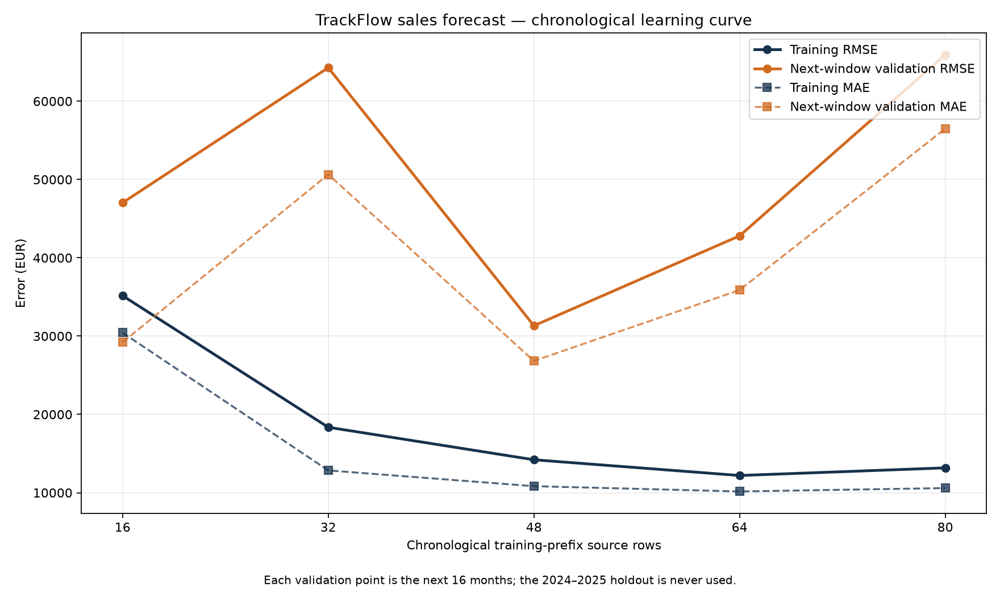

# TrackFlow Sales Forecast — Formal Evaluation

## Decision

**Classification: overfitting.** Training RMSE falls from 35,159 EUR on the
smallest chronological prefix to 13,173 EUR on the largest, while the
next-window validation RMSE does not converge: it ranges from
31,323 to
65,925 EUR and ends at
65,925 EUR. The final temporal generalization gap is
52,752 EUR. The curves therefore show increasingly
good in-sample fit without a matching improvement on later months.

The suspected root cause is specific: the Random Forest fits absolute revenue levels and absolute
lag values well inside the observed range, but trees cannot extrapolate the generator's continuing
compound trend beyond learned leaf values. **Corrective action:** change the model target to
year-over-year revenue growth (`revenue_t / revenue_t-12 - 1`), forecast that stationary quantity
with the same chronological protocol, and recursively reconstruct revenue levels. This directly
addresses bounded absolute-level extrapolation; it is not a generic request for more data or model
complexity.

## Dataset, split, and model

The dataset is [generated, not observed](../raw/trackflow_sales.csv), with SHA-256
`db18966a665e70ea85f5c979c1574b95615520872bab51035d676915284a8433`. Its [standard-library generator](../../scripts/generate_trackflow_sales.py) uses
seed 42. The owner approved generation because the assignment's claimed input was absent and
TrackFlow production has no revenue dimension.

The fixed Random Forest was selected over XGBoost because only 96 training months (84 after lag
warm-up) exist, bagging is straightforward to explain to Finance, and there was no responsible
holdout-driven tuning budget. Features are calendar cycle, quarter, peak/trough flags, monotonic
time index, and strictly prior revenue lags 1 and 12. No same-month target, shipment count, or
average-revenue companion enters a feature. The 2024–2025 holdout remains untouched by the
cross-validation and learning-curve diagnosis.

## Five-fold chronological cross-validation

`TimeSeriesSplit(n_splits=5)` creates expanding training prefixes followed by five disjoint,
ordered 16-month validation windows. Feature construction and model fitting restart inside every
fold; validation is forecast recursively from that fold's origin. No fold shuffles, overlaps, or
reaches the 2024–2025 holdout.

| Fold | Train source / post-lag | Validation | Train dates | Validation dates | Train MAE / RMSE | Validation MAE / RMSE |
|---:|---:|---:|---|---|---:|---:|
| 1 | 16 / 4 | 16 | 2016-01-01 → 2017-04-01 | 2017-05-01 → 2018-08-01 | 30,433 / 35,159 EUR | 29,210 / 47,034 EUR |
| 2 | 32 / 20 | 16 | 2016-01-01 → 2018-08-01 | 2018-09-01 → 2019-12-01 | 12,848 / 18,358 EUR | 50,646 / 64,281 EUR |
| 3 | 48 / 36 | 16 | 2016-01-01 → 2019-12-01 | 2020-01-01 → 2021-04-01 | 10,834 / 14,208 EUR | 26,831 / 31,323 EUR |
| 4 | 64 / 52 | 16 | 2016-01-01 → 2021-04-01 | 2021-05-01 → 2022-08-01 | 10,159 / 12,198 EUR | 35,878 / 42,804 EUR |
| 5 | 80 / 68 | 16 | 2016-01-01 → 2022-08-01 | 2022-09-01 → 2023-12-01 | 10,592 / 13,173 EUR | 56,487 / 65,925 EUR |

Because the five folds are the complete predeclared evaluation set, variability uses population
standard deviation (`ddof=0`), not a sample estimate:

- Training MAE: **14,973 ±
  7,785 EUR**.
- Training RMSE: **18,619 ±
  8,532 EUR**.
- Validation MAE: **39,810 ±
  11,763 EUR**.
- Validation RMSE: **50,273 ±
  13,165 EUR**.

The 16-month validation windows are small, so the spread is material rather than noise to hide.
Validation RMSE has a coefficient of variation of
26.2%.
Performance across temporal partitions is therefore **not stable enough for operational use**.

RMSE is the primary business metric because large peak-season misses can create disproportionate
warehouse staffing and capacity risk; squaring errors makes those misses visible. MAE remains the
companion metric because it expresses the typical monthly miss directly in EUR and prevents one
large month from being mistaken for routine performance. Formally,
`MAE = mean(|actual - predicted|)` and `RMSE = sqrt(mean((actual - predicted)^2))`.

The relative pattern—not an absolute error threshold—drives the diagnosis: training errors become
low and remain low as the prefix grows, while validation errors oscillate and finish far above the
training curve. The two curves do not converge.

## Accepted holdout diagnostics

The untouched 2024–2025 result remains:

- MSE: 4,234,779,297.39 EUR²; RMSE:
  65,075.18 EUR
  (9.03% of mean holdout revenue).
- PSI over predicted revenue: 11.0910.
- Continuous-target Gini / Somers' D: 0.5000.
- D'Agostino–Pearson K²: 7.7936,
  `p = 0.020307`.

MSE is mean squared error. PSI compares training-prediction and recursive-test-prediction
distributions using training-derived bins; it does not measure LA/Zaragoza mix because every row is
`consolidated`. Somers' D measures rank concordance over comparable actual pairs. K² tests residual
normality and is not an accuracy score; 24 residuals give it limited power.

The specification anticipated little or no PSI because the generator has no regime change, but the
selected predicted-revenue PSI is **significant**, not stable. That anticipation is wrong for this
subject: later generated revenue levels plus bounded tree extrapolation shift the prediction
distribution. This is still not evidence of a real-world regime change or model robustness.

## Required honesty and scope limits

- The data is generated rather than observed; deterministic trend and seasonality are easier to
  learn than real revenue, so every reported error is optimistic relative to production behavior.
- The generator contains no unexpected regime change. Whether PSI appears stable or significant,
  it describes this generator/model pairing and does not demonstrate robustness.
- Only 96 source training months exist, and the five validation windows contain 16 months each.
  Those sizes bound every conclusion.
- The P10–P90 band in the prediction chart is internal tree disagreement, not a calibrated
  confidence or prediction interval.
- This is an offline analysis artifact. It is not approved for serving, Finance forecasts,
  warehouse staffing, or any production decision.

## Ticket answers

1. **Fit diagnosis:** overfitting, evidenced by a persistent and widening temporal
   train/validation gap rather than an arbitrary error threshold.
2. **Partition stability:** not stable; validation RMSE is
   50,273 ±
   13,165 EUR across five small chronological
   folds.
3. **Corrective action:** forecast year-over-year revenue growth and reconstruct levels
   recursively, targeting the absolute-level extrapolation failure directly.
