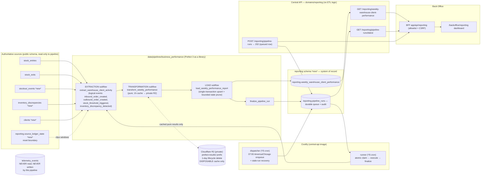

# PIPELINE_DESIGN — TrackFlow Business Performance Data Pipeline

**Deliverable:** Weekly Warehouse & Client Performance Report (Milestone 6, Parts 1–3 consolidated)
**Status:** Revision 3 approved design, with implementation evidence appended. GATE-8a was accepted
on 2026-07-14 using the application-managed boto3 mechanism documented in
`business_performance/spikes/R2_CACHE_SPIKE.md`; remaining owner gates are tracked in
[§15](#15-approval-gates).
**Authoritative inputs:** `data/context_pipeline_design.md` (business contract) > current repository (implemented behavior) > `data/pipeline_data_intructions.md` (milestone deliverables) > `docs/planning/telemetry/` (historical context only).
**Date:** 2026-07-14. All repository facts below were re-verified against this checkout on this date.

**Approved in review (no longer open questions):** daily automatic refresh at 07:00 America/Chicago through the always-on Compose reporting worker feeding a durable PostgreSQL queue; Prefect kept strictly as an in-process library (no Prefect Cloud, no permanent Prefect server, no Prefect-managed scheduling, no separate Prefect database); optional one-hour, content-digest-keyed cache behavior backed by a **private Cloudflare R2 bucket**; administrator-only manual trigger preserved. TrackFlow PostgreSQL remains the durable operational and business system of record throughout. Production-hardening details supersede the original cron proposal below and are archived in `docs/archive/agent_implementation_plans/2026-07-15-engagement-6-production-deployment-hardening.md`.

---

## 0. Purpose

> This pipeline produces the **Weekly Warehouse & Client Performance Report** — exactly one row per `warehouse` × `client_id` × ISO `week_start` (the Monday of the ISO week, UTC) computing **Inbound Volume**, **Outbound Throughput**, **Stockout Frequency**, and **Discrepancy Rate** — for **Thomas Harry (CEO)** and **Ana Whitfield (Head of Warehouse Operations)**, fresh as of Monday morning each week, replacing the manual Sunday-night executive build (`memory-bank/projectbrief.md:21`).

- **Cadence:** report grain is **weekly**; the data is **refreshed automatically every day at 07:00 America/Chicago** (Dallas local time, CST/CDT-aware), so the current week's row is a live week-to-date figure and Monday's 07:00 run finalizes the just-closed week. Audited manual runs remain available to administrators.
- **Grain / idempotency key:** `(warehouse, client_id, week_start)` — enforced by a `UNIQUE` constraint; upsert keys off it.
- **Destination:** `reporting.weekly_warehouse_client_performance` (dedicated `reporting` PostgreSQL schema).
- **Exposure:** `GET /reporting/weekly-warehouse-client-performance`, `GET /reporting/pipeline-runs/latest`, `POST /reporting/pipeline-runs`.
- **Hard rules:** the pipeline **never writes to `telemetry_events`** and never reads it for these KPIs; the existing technical telemetry system (`central_api/domains/telemetry/`, its endpoints, its best-effort semantics, migration `20260709_0004`) is preserved unchanged.

Everything in this document traces back to producing those four numbers correctly, idempotently, observably, and recoverably.

---

## 1. Current state (evidence matrix)

Every row below is an **implemented fact** verified in this checkout, with exact paths. Proposals appear only in §3 onward and are labeled as such.

### 1.1 Technical telemetry (exists — stays untouched)

| Fact | Evidence |
|---|---|
| Single table `telemetry_events`: `id, event(64), category(operational\|security), occurred_at timestamptz UTC, service, env, severity, warehouse(3, NULL or LA/ZGZ), reason_code(48), value int, properties JSONB`; indexes `(event, occurred_at)`, `(event, warehouse, occurred_at)` | `services/central-api/central_api/domains/telemetry/models.py:26-53`; migration `20260709_0004_telemetry_events.py` |
| Only two event types exist: `inventory.dispatch.rejected`, `api.access.denied`, with per-event property allowlists | `central_api/domains/telemetry/events.py:11-35` |
| Delivery is **best-effort, post-response** (Starlette `BackgroundTask`; recorder swallows all exceptions; events may be lost on crash) | `central_api/domains/telemetry/recorder.py:36-57`; `central_api/main.py:94-123` |
| Production retention is **7 days for both categories**, pruned daily by a Coolify-scheduled command | `compose.coolify.yaml:47-48,99-109`; `scripts/prune_telemetry_events.py` |
| `client_id` is on the brief's explicit **never-store** list for `telemetry_events` | `docs/briefs/06-data-pipelines-telemetry.md`; `docs/runbooks/telemetry-inventory.md` |
| Exact operational metrics are **not** events: `GET /telemetry/metrics/{dispatch,receiving,stock-loss,access-denials}` compute aggregates from `stock_entries`/`stock_exits` (exact) and `telemetry_events` (best-effort, labeled "diagnostic") | `central_api/domains/telemetry/router.py:29-59`; `repository.py:1-5` |
| **None** of the four context event types (`inbound_order_created`, `outbound_order_created`, `stock_threshold_triggered`, `inventory_discrepancy_detected`) exist anywhere; `telemetry_events` has no `client_id` column | grep-verified repo-wide |
| No `services/reporting/`, no `services/telemetry/analysis.py`, no `GET /telemetry/report` exist in code — only in historical design docs under `docs/planning/telemetry/` | grep-verified |

**What the existing technical report answers:** engineering questions — dispatch/receiving/stock-loss volume per warehouse per UTC day, rejected-dispatch diagnostics, access-denial diagnostics. **The gap:** no per-**client** dimension anywhere, no weekly business rollup, no stockout signal, no inventory-accuracy signal, and nothing a non-technical stakeholder can read without translation. That gap is exactly the deliverable in §0.

### 1.2 Inventory domain (the trustworthy business ledger)

| Fact | Evidence |
|---|---|
| `SKU`: `id, name, sku, client_name(160), category, warehouse(3)`; CHECKs on category and warehouse (`LA`/`ZGZ`); `client_name` is **mutable display text — there is no client_id** | `central_api/domains/inventory/models.py:19-26` |
| `StockEntry` (inbound): `id, sku_id, quantity(>0 CHECK), reference, warehouse, created_at timestamptz UTC, user_uuid`; composite FK to `(skus.id, skus.warehouse)` RESTRICT; indexes `(sku_id, warehouse, created_at)`, `(created_at)` | `models.py:39-61` |
| `StockExit` (outbound): same shape plus `exit_type CHECK (dispatch\|loss)` and `tracking_number` (NOT NULL iff dispatch) — **one dispatch row = one outbound order** | `models.py:68-86` |
| Stock level is **computed** (entries − exits), never persisted; outbound dispatch locks the SKU row (`get_sku_for_update`) and checks availability atomically | `inventory/service.py:59-70,150-177` |
| **No** minimum-stock threshold, stockout model, audit model, or discrepancy model exists in Central API | grep-verified |
| `packages/shared/` holds a disconnected TypeScript `minStockThreshold` demo — delivered/protected Engagement-2 behavior, **not** the Central API system of record | `packages/shared/`; AGENTS.md protected paths |
| Incidents support category `inventory_discrepancy` but records carry **no link** to client, SKU, or outbound order | `packages/trackflow_incidents/trackflow_incidents/contracts.py:9`; `central_api/domains/incidents/models.py:20-47` |

### 1.3 Platform conventions (reused by this design)

| Convention | Evidence |
|---|---|
| Modular FastAPI monolith; every domain = `router → service → repository → SQLModel` under `central_api/domains/` | `services/central-api/central_api/domains/` |
| Alembic at head `20260713_0005`; naming `YYYYMMDD_NNNN_name.py`; all tables in `public` — **no non-public schema exists yet**; model imports registered in `migrations/env.py` (no `include_schemas` today); migration role (`MIGRATION_DATABASE_URL`) separated from runtime role | `services/central-api/migrations/`; `core/config.py:53-56`; `compose.coolify.yaml:125-133` |
| Auth: `current_principal` / `write_principal` (CSRF for cookie tokens); role is a claim; typed domain errors per domain + `SQLAlchemyError → 503` boundary handler | `core/dependencies.py:15-31`; `central_api/main.py:141-145` |
| Single-writer concurrency precedent: `pg_try_advisory_lock` on a config-owned key, held on a dedicated connection; DB-row kill switch (`operations_feed_control`) | `scripts/operations_feed.py:77-79,242-257`; `domains/operations/` |
| Scheduling precedent: Coolify cron invoking container commands (`telemetry-prune` daily, `db-size-guard` ~15 min, `profiles: ["scheduled"]`, central-api image) — **no Prefect anywhere in the repo** | `compose.coolify.yaml:99-123`; grep of all pyprojects/lockfiles |
| Supabase Free bounding: `scripts/db_size_guard.py` — ≥400 MB prunes telemetry; ≥450 MB pauses feed, **TRUNCATEs `stock_exits`/`stock_entries`**, reseeds | `scripts/db_size_guard.py:42-93` |
| Packaging: isolated `uv` projects; **no root pyproject, no root `tests/`**; `data/` contains only READMEs and nothing imports it | per-project `pyproject.toml`s; root `conftest.py` |
| Docker: `docker/central-api.Dockerfile` copies `packages/trackflow_auth`, `packages/trackflow_incidents`, `services/central-api` — **not `data/`** | `docker/central-api.Dockerfile:6-8` |
| CI: `release-checks.yml` per-project matrix — Python: `ruff` → `mypy` → `pytest --cov` → `uv build`, disposable Postgres `127.0.0.1:55432` + `alembic upgrade head` for central-api (coverage `fail_under = 90`); Node: `type-check`/`lint`/`test`/`build` | `.github/workflows/release-checks.yml:85-109`; `services/central-api/pyproject.toml:68-75` |
| Central-api tests: conftest refuses non-local DBs; autouse `TRUNCATE … RESTART IDENTITY CASCADE` across all app tables | `services/central-api/tests/conftest.py:26-57` |
| Back Office: Operations Overview at `/`; Telemetry Fulfilment/Security under `/backoffice/telemetry/`; read-only telemetry BFF with `ALLOWED_ROUTES` allowlist; `lib/server/proxy.ts` forwards `X-CSRF-Token` for state-changing verbs; `fetchWithAuth`; nav array in `components/BackofficeNavigation.tsx`; Vitest 4 + RTL; Junecoast/Tailwind; **no charting dep** | `uis/backoffice/app/api/telemetry/[[...path]]/route.ts`; `lib/server/proxy.ts`; `lib/auth/client-http.ts`; `lib/hooks/useAutoRefresh.ts` |

**Reusable:** advisory-lock single-writer pattern, BFF allowlist + proxy + CSRF forwarding, `useAutoRefresh`, typed-domain-error pattern, migration role split, per-project uv/CI shape.
**Missing:** all four source event types, `client_id`, stock threshold, stockout/discrepancy records, `reporting` schema, Prefect, root Python test project, `data/` packaging, any object storage.
**Misleading:** `docs/planning/telemetry/*` describes a richer exercise model that contradicts shipped behavior — historical context only.
**Protected:** `packages/shared/`, delivered briefs/archives, `telemetry_events` schema and contracts, best-effort recorder semantics, the two pipeline context files.

---

## 2. Mismatch register

Contradictions between sources are recorded here, not silently resolved. "Gate" = owner approval required before implementation (see §15).

| # | Mismatch | Effect | Resolution | Gate |
|---|---|---|---|---|
| **M1** | Milestone names the destination `reporting.business_metrics`; the context file names `reporting.weekly_warehouse_client_performance` with exact DDL | Two table names for one deliverable | Context file wins per stated precedence. | — |
| **M2** | Context §3: "Your source is `telemetry_events`" with 4 event types. Repo: none exist; the table is best-effort, has **no `client_id`** (forbidden by the brief), and prod retention is **7 days** | Reading the four KPIs from `telemetry_events` is impossible today and unsound if forced | Source from durable business tables + new durable business-event tables; keep the context's four event names as the pipeline's **logical extraction vocabulary** (§3.3). `telemetry_events` is neither read nor written by this pipeline. | **GATE-3** |
| **M3** | Context §6: new module `services/reporting/`. Repo: modular monolith; domains are the module boundary | A standalone service would add a deploy surface for three endpoints | Implement as `central_api/domains/reporting/` — separate from `domains/telemetry/`, zero new infrastructure. | — |
| **M4** | Context §2 prose: Discrepancy Rate = "share of the week's outbound **orders** associated with a discrepancy"; context §4 formula: `discrepancy_events_count / outbound_orders_count` | Without a schema guarantee, one order with several discrepancy events would push the formula above 1 | **Resolved by schema:** `inventory_discrepancies` carries `UNIQUE (stock_exit_id)` — one discrepancy occurrence per outbound order. `discrepancy_events_count` therefore equals distinct affected orders, and the **context formula holds exactly** (≤ 1 by construction). Multiple observations of the same discrepancy, if ever needed, live in a child audit table (§3.6) without changing the KPI occurrence contract. | **GATE-2** (schema semantics sign-off) |
| **M5** | DB warehouse vocabulary `LA`/`ZGZ`; context vocabulary `los_angeles`/`zaragoza` | Reporting rows must match the context contract | DB keeps `LA`/`ZGZ`; the transformation maps `LA → los_angeles`, `ZGZ → zaragoza` (`data/process/business_performance/vocabulary.py`); reporting table CHECK-constrains the two context values. | — |
| **M6** | Milestone requires `tests/pipelines/test_pipeline.py` at monorepo root; repo has isolated uv projects | The evaluator-visible path must exist and run in CI | Keep the literal root path as the `data/` uv project's suite (`testpaths = ["../tests/pipelines"]`; root `conftest.py` updated; new `data` CI matrix entry). | — |
| **M7** | Milestone: runnable as `python data/pipelines/pipeline.py`; repo has no root venv | The literal command needs an environment | Canonical: `uv run --project data python data/pipelines/pipeline.py`; the literal command works inside the activated `data/.venv`. | — |
| **M8** | Manual trigger must not fake durable execution; no Prefect server exists | Manual runs must survive API restarts and be auditable | The POST **persists a queued run-request row** and returns `202`; the runner container executes it from the durable queue (§9). Approved direction. | — |
| **M9** | Context §6 example shows `"client_id": "fashion-co"` (name-derived slug); review finding 1 requires generated opaque UUIDs; `docs/planning/telemetry/plan.md` requires client_id "opaque, never brand names" | A name-derived slug leaks the brand and drifts on renames | `clients.id` is a **generated UUID** (`gen_random_uuid()`), never derived from the name. The reporting API returns `client_id` (UUID) **plus** `client_name` (display) so the report stays legible — a documented, additive extension of the context response shape. | **GATE-1** |
| **M10** | Context intent "fresh as of Monday morning"; approved decision: daily 07:00 America/Chicago refresh | Cadence is now stricter than the context minimum | Daily refresh satisfies and exceeds the weekly-freshness contract; grain stays weekly. Approved; documented, no gate. | — |

---

## 3. KPI feasibility and prerequisite data

**Honest summary: the repository can compute two of the four KPIs today (minus the client dimension), and cannot compute the other two at all.** The gaps are source-data gaps and are prerequisites (§15 GATE-1).

### 3.1 Per-KPI matrix

| | **Inbound Volume** | **Outbound Throughput** | **Stockout Frequency** | **Discrepancy Rate** |
|---|---|---|---|---|
| **Business definition** | Units of a client's goods a warehouse received during the ISO week | Outbound orders a warehouse picked and dispatched for a client during the ISO week | Times during the week a client's SKU at a warehouse fell to/below its configured minimum | Share of the week's outbound orders associated with a detected inventory discrepancy |
| **Computed field** | `inbound_units_count = SUM(stock_entries.quantity)` | `outbound_orders_count = COUNT(stock_exits WHERE exit_type='dispatch')` | `stockout_events_count = COUNT(stockout_events)` | `discrepancy_events_count = COUNT(inventory_discrepancies)`; `discrepancy_rate = discrepancy_events_count / outbound_orders_count` (exact per M4) |
| **Required fields & grain** | quantity, warehouse, client, UTC timestamp → ISO week | exit row identity, warehouse, client, UTC timestamp | threshold-crossing record: SKU, warehouse, client, UTC timestamp | discrepancy occurrence with **UNIQUE NOT NULL link to an outbound order**, warehouse, client, UTC timestamp |
| **Current trustworthy source** | `stock_entries` (durable, append-only, CHECK quantity>0, UTC) | `stock_exits` (durable, dispatch⇒tracking_number NOT NULL) | **none** | **none** |
| **Missing** | stable `client_id` (only mutable `SKU.client_name`) | stable `client_id` | configured threshold; stockout occurrence model | discrepancy occurrence model; order linkage; `client_id` |
| **Computable today?** | Yes, except client dimension | Yes, except client dimension | **No** | **No** |
| **Prerequisites** | `clients` table + `skus.client_id` (§3.4) | same | `skus.min_stock_threshold` + `stockout_events` (§3.5) | `inventory_discrepancies` + creation paths (§3.6) |
| **Dedupe identity** | `stock_entries.id` (PK; append-only) | `stock_exits.id` | UNIQUE per triggering movement — at most one crossing per movement | **`UNIQUE (stock_exit_id)`** — at most one occurrence per outbound order, so the rate formula is exact |
| **Data-quality checks (validate task)** | sums ≥ 0; warehouse ∈ {los_angeles, zaragoza} after mapping; client_id present | counts ≥ 0; same dimension checks | count ≥ 0; every event maps to an existing SKU/client | `0 ≤ rate ≤ 1`; rate = 0 when `outbound_orders_count = 0`; `discrepancy_events_count ≤ outbound_orders_count` |
| **Late arrival** | absorbed by bounded, reset-aware window recompute (§8.1) | same | same | same |

### 3.2 Resolved source questions

1. **Use `stock_entries`/`stock_exits` for Inbound/Outbound rather than duplicating movements into best-effort telemetry?** **Yes** — exact, replayable, transactional, and already the platform's stated source for exact metrics.
2. **Stable opaque `client_id`?** Generated UUIDs in a new `clients` table (§3.4); `client_name` is never an identifier.
3. **What is one stockout event?** A **downward crossing**: a stock movement takes computed stock from strictly above `min_stock_threshold` to at-or-below it. Not "every write while below" (the ~5-second operations feed would turn that into noise), not level sampling.
4. **Threshold storage and safe change?** `skus.min_stock_threshold INTEGER NOT NULL DEFAULT 0 CHECK (>= 0)`; `0` = not configured, never emits. Managed through the administrative contract in §3.7. A threshold edit does not emit events retroactively or immediately — only subsequent movements cross.
5. **What creates a discrepancy?** Manual recording endpoint + low-rate synthetic emission by the operations feed (§3.6). Incidents remain a separate human workflow.
6. **Order linkage with an exact rate?** `inventory_discrepancies.stock_exit_id` is **NOT NULL + UNIQUE**, FK to a dispatch `stock_exits` row (service-enforced). One occurrence per order by schema, so `COUNT(*)` *is* the distinct-order count and the context formula cannot exceed 1.
7. **`LA`/`ZGZ` mapping?** M5 — single mapping in `vocabulary.py`, applied only in transformation; unknown codes fail validation loudly.
8. **Four context event types without weakening telemetry?** Not as `telemetry_events` rows (M2); supported as the logical extraction vocabulary (§3.3).

### 3.3 Source strategy — options compared, one recommended

**Option A (recommended): authoritative domain tables + durable business-event tables.** Inbound/Outbound from `stock_entries`/`stock_exits`; stockouts and discrepancies from two new tables written **transactionally with the business operation** (inside the same locked transaction `InventoryService` already uses). Technical telemetry keeps its exact current semantics; nothing best-effort becomes authoritative.

**Option B (rejected): add the four event types to `telemetry_events`.** Requires storing `client_id` (forbidden), makes a deliberately lossy path the system of record, and 7-day retention cannot serve weekly recomputation.

**Option C (rejected fallback): dual-write mirrors without `client_id`.** Still cannot compute per-client KPIs from telemetry alone; doubles write volume; blurs the exact/best-effort line.

**Compatibility with the course requirement:** the extraction subflow exposes its four record sets under the context's exact event vocabulary — `inbound_order_created` (from `stock_entries`), `outbound_order_created` (from `stock_exits` dispatch rows), `stock_threshold_triggered` (from `stockout_events`), `inventory_discrepancy_detected` (from `inventory_discrepancies`). Logical taxonomy, KPI mapping, and aggregation match the context exactly; the physical source is durable tables. **GATE-3.**

**Retention:** 7-day `telemetry_events` retention untouched and irrelevant (nothing is read from it). New business-event tables: **26 ISO weeks** retention via `scripts/prune_business_events.py` on the existing daily cron pattern — far beyond the recompute window, bounded for Supabase Free.

### 3.4 Prerequisite: `clients` table and `skus.client_id` (revised — UUIDs)

- `clients`: `id UUID PRIMARY KEY DEFAULT gen_random_uuid()` — **generated opaque identifier, never derived from any name**; `display_name VARCHAR(160) UNIQUE NOT NULL`; `created_at`/`updated_at timestamptz UTC`.
- `skus.client_id UUID NOT NULL REFERENCES clients(id)` — backfilled in migration 0006 (§6.1), then constrained and indexed.
- **Duplication/drift resolution:** `skus.client_name` is **dropped** in the same migration. `clients.display_name` becomes the single source of display truth; every read that previously used `skus.client_name` derives it via join. There is no second copy to drift.
- **Display-name contract:** inventory API responses (`SKURead`, movement listings) keep their existing `client_name` field, now join-derived — the external response contract is preserved. Product create/update requests take `client_id` (UUID) instead of free-text `client_name`; the Back Office product form gains a client selector fed by `GET /inventory/clients`. The reporting API returns both `client_id` and `client_name` per entry (§10). A client rename updates `clients.display_name` once and is reflected everywhere on next read; historical reporting rows stay joinable because the UUID never changes.

### 3.5 Prerequisite: `skus.min_stock_threshold` + `stockout_events`

`stockout_events` (public schema, inventory domain):

| column | type | notes |
|---|---|---|
| `id` | int PK | |
| `sku_id`, `warehouse` | composite FK → `(skus.id, skus.warehouse)` RESTRICT | matches existing ledger FK pattern |
| `client_id` | UUID FK → `clients.id` | denormalized for extraction speed; written in the same transaction from the SKU row |
| `threshold_at_event`, `stock_after` | int | audit of why it fired |
| `stock_exit_id` | int **NOT NULL, UNIQUE** FK → `stock_exits.id` | the triggering outbound movement (dispatch or loss) — one crossing per movement |
| `occurred_at` | timestamptz UTC | = movement `created_at` |

Index `(warehouse, client_id, occurred_at)`. Emission **only** inside `InventoryService.record_outbound`, computed under the existing SKU row lock: `before > threshold AND after <= threshold AND threshold > 0` ⇒ insert **in the same transaction** as the movement. There is deliberately **no inbound path**: a positive `stock_entries` quantity can never cross the threshold downward, so `record_inbound` never emits — inbound movements matter only by re-arming (raising stock back above the threshold so a future exit can cross again).

### 3.6 Prerequisite: `inventory_discrepancies` (revised — one occurrence per order)

| column | type | notes |
|---|---|---|
| `id` | int PK | |
| `stock_exit_id` | int **NOT NULL, UNIQUE** FK → `stock_exits.id` | service-enforced: must be a `dispatch` row. **UNIQUE = the KPI occurrence contract** |
| `sku_id`, `warehouse` | composite FK → skus | |
| `client_id` | UUID FK → `clients.id` | |
| `quantity_delta` | int, CHECK `<> 0` | recorded − physical |
| `source` | CHECK in (`manual`, `feed`) | |
| `detected_at` | timestamptz UTC | first detection |
| `created_by_user_uuid` | VARCHAR(36) NULL | external identifier, **not** a FK (TinyDB users) |

Indexes: `(warehouse, client_id, detected_at)`. A second report against the same order returns `409 DISCREPANCY_EXISTS` from the manual endpoint (and is skipped by the feed). **If multiple observations per discrepancy are ever needed**, they go in a child audit table `inventory_discrepancy_observations (id, discrepancy_id FK, observed_at, quantity_delta, note?, created_by_user_uuid)` — deferred, and explicitly **not** part of the KPI: the occurrence contract stays `UNIQUE (stock_exit_id)`.

Creation paths: `POST /inventory/discrepancies` (§3.7) and a low-rate synthetic emitter in `scripts/operations_feed.py` targeting recent dispatches without an existing discrepancy (same kill switch, same single-writer lock).

### 3.7 Administrative contract: clients and thresholds (new)

The pipeline's client and stockout dimensions are only trustworthy if operators can actually manage them. Repository-consistent additions inside the inventory domain:

**API (all state-changing routes: `write_principal` + admin-role check in the service — same server-side pattern as §10's POST):**

| Route | Auth | Behavior |
|---|---|---|
| `GET /inventory/clients` | `current_principal` | List `{client_id, client_name}` ordered by name — feeds UI selectors |
| `POST /inventory/clients` | admin | Create client from `{display_name}`; UUID generated server-side; duplicate name → `409 CLIENT_NAME_EXISTS` |
| `PATCH /inventory/clients/{client_id}` | admin | Rename (`display_name` only; the UUID is immutable); duplicate → `409` |
| `POST /inventory/products` (existing, revised) | `write_principal` | Request gains `client_id` (must exist → else `422`) and optional `min_stock_threshold` (int ≥ 0, default 0); `client_name` removed from the request schema |
| `PATCH /inventory/products/{sku_id}` (new) | `write_principal` | Update `min_stock_threshold` (int ≥ 0) **only**. **`client_id` is immutable after SKU creation in v1** — a reassignment attempt returns `409 CLIENT_ID_IMMUTABLE`. Rationale: stock movements store only `sku_id` while stockout/discrepancy records snapshot `client_id`, so reassignment would retroactively move inbound/outbound history to the new client while event metrics stayed under the old one — silently corrupting historical attribution. If reassignment is ever needed, it requires an effective-dated SKU↔client mapping (deferred; explicitly out of v1) |
| `POST /inventory/discrepancies` | `write_principal` | §3.6; validates dispatch exit, SKU/warehouse match, uniqueness |

**Validation:** Pydantic at the boundary (`422` on type/shape), service-level `409` conflicts, threshold `>= 0`, client existence checks. No enumeration-sensitive data involved.

**Migration/backfill:** migration 0006 creates one `clients` row per distinct legacy `client_name` and backfills `skus.client_id` before dropping the column — no manual step required for existing SKUs; new SKUs must name a `client_id` at creation.

**UI:** Back Office inventory products page gains a client selector (from `GET /inventory/clients`) and a threshold input on create/edit; an admin-only "Clients" management panel (list/create/rename) added to the inventory area. No new top-level nav item.

**Tests:** client CRUD (incl. duplicate-name 409, rename immutability of UUID), product create requires valid `client_id`, threshold validation bounds, **`client_id` immutability (reassignment attempt → 409)**, discrepancy endpoint validation/uniqueness, UI component tests for selector and threshold field (client shown read-only on edit).

---

## 4. Additional KPI discipline

| Candidate | Verdict | Reason |
|---|---|---|
| `outbound_units_count` (SUM of dispatch quantities) | **Defer** | Trustworthy and cheap, but v1 ships the exact contracted schema; additive later |
| Stock-loss events/units per warehouse/client | **Defer** | Same contract discipline; exact warehouse-level daily figures already exist |
| Fulfilment / dispatch failure rate | **Reject (v1)** | Denominator requires the deferred durable-outbox work; the only failure signal today is best-effort |
| Receiving-to-dispatch cycle time | **Reject (v1)** | No entry↔exit linkage exists |

---

## 5. Target architecture



**Dependency direction:** `services/central-api` → `data/` (imports queue helpers); `uis/backoffice` → Central API via BFF. Never `data/` → `services/`. ETL logic only in `data/pipelines/`; pure transforms only in `data/process/`; the reporting API duplicates zero ETL logic.

**Why technical telemetry stays separate:** it is deliberately best-effort (post-response, exception-swallowing, 7-day retention) so it can never slow or fail a business request. Authoritative business reporting needs the opposite properties. One system cannot honestly be both.

**Prefect boundary (owner-approved amendment, July 15, 2026):** flows still execute in-process in
the reporting worker, but their orchestration API is now a private, digest-pinned Prefect 3.7.8
Server backed by a dedicated PostgreSQL 16 database. There is no Prefect Cloud account and no
work-pool or Prefect-managed dispatch. **TrackFlow PostgreSQL `reporting.pipeline_runs` remains the
sole business-work queue and dispatch authority**; Prefect state provides task-level recovery and
history only. The dedicated Prefect database never shares TrackFlow/Supabase credentials or
storage. R2 remains optional and cannot be a correctness dependency (§9.4).

**Execution-hardening amendment (Phase 2):** each claimed row is executed through explicit
claim/execute/finalize steps. A daemon renewal thread extends only the PostgreSQL lease while the
flow runs; every correlation, stage, publication, and final transition remains claim-token CAS
guarded. The worker probes the dedicated Prefect API before claiming, records
`prefect_flow_run_id`, deterministic run name, `current_stage`, and truthful progress, reconciles
orphaned non-terminal Prefect runs at startup, and terminates the process on a bounded run watchdog.
Readiness treats fresh leases and real stage progress separately, so a hung stage cannot report
healthy merely because its renewal thread is alive. Alembic revision `20260716_0010` adds only
backward-compatible nullable/defaulted fields and the two fixed error codes.

### 5.1 `data/` packaging

- **New uv project `data/pyproject.toml`** — `trackflow-data-pipelines`, `requires-python = ">=3.11"`, hatchling `packages = ["pipelines", "process"]`; ruff (line-length 120, E/F/I/UP/B/SIM/RUF), mypy `strict = true`, pytest `testpaths = ["../tests/pipelines"]`, coverage `fail_under = 90`.
- **Dependencies:** `prefect>=3`, `prefect-aws` (S3-compatible result storage), `sqlalchemy>=2`, `psycopg[binary]`. **No pandas** — pure-Python transforms keep tests in-memory and the image slim.
- **Central API dependency:** `[tool.uv.sources] trackflow-data-pipelines = { path = "../../data", editable = true }` (existing pattern). No `sys.path` manipulation.
- **Docker:** `docker/central-api.Dockerfile` adds `COPY data /app/data` before `uv sync --frozen --no-dev`. Dispatcher/runner reuse this image.
- **CLI:** `uv run --project data python data/pipelines/pipeline.py` from the repo root (M7).
- **CI:** new `data` matrix entry in `release-checks.yml`, same command shape, using the disposable Postgres + `alembic upgrade head`.

---

## 6. Reporting persistence (Alembic plan)

Three migrations in `services/central-api/migrations/versions/`, using the existing naming convention, with model imports added to `migrations/env.py`; each is verified `upgrade → downgrade → upgrade` locally and in CI. Migrations 0007 and 0008 are additive; migration 0006 also removes the superseded `skus.client_name` column after its UUID backfill and has an explicit data-preserving downgrade.

**Alembic multi-schema handling (new requirement):** migration 0008 introduces the repo's first non-public schema, so `migrations/env.py` is updated to pass **`include_schemas=True`** in both offline and online `context.configure(...)`, with an `include_object` filter that scopes autogenerate to `{"public", "reporting"}` (so foreign schemas — e.g. Supabase-managed ones — are never diffed or dropped). The `alembic_version` table stays in `public` (explicitly configured). A CI check runs `alembic upgrade head` then an autogenerate diff and asserts it is **empty** — proving models and migrations agree across both schemas.

### 6.1 `20260714_0006_clients_and_client_id`
Create `clients` (UUID PKs); insert one row per distinct legacy `skus.client_name`; add `skus.client_id` (nullable → backfill via name join → `NOT NULL` + FK + index); **drop `skus.client_name`** (§3.4). Single transaction. **Downgrade:** re-add `client_name` (backfilled from `clients.display_name`), drop `client_id`, drop `clients`.

### 6.2 `20260714_0007_stockout_and_discrepancy_events`
Add `skus.min_stock_threshold INTEGER NOT NULL DEFAULT 0 CHECK (>= 0)`; create `stockout_events` (§3.5) and `inventory_discrepancies` (§3.6, **including `UNIQUE (stock_exit_id)`**). **Downgrade:** drop both tables and the column.

### 6.3 `20260714_0008_reporting_schema`
```sql
CREATE SCHEMA IF NOT EXISTS reporting;

CREATE TABLE reporting.weekly_warehouse_client_performance (
  id uuid PRIMARY KEY DEFAULT gen_random_uuid(),
  warehouse text NOT NULL,
  client_id uuid NOT NULL REFERENCES public.clients(id),   -- cross-schema FK; RESTRICT (default) — clients with history cannot be deleted
  week_start date NOT NULL,
  inbound_units_count integer NOT NULL DEFAULT 0,
  outbound_orders_count integer NOT NULL DEFAULT 0,
  stockout_events_count integer NOT NULL DEFAULT 0,
  discrepancy_events_count integer NOT NULL DEFAULT 0,
  discrepancy_rate numeric NOT NULL DEFAULT 0,
  computed_at timestamptz NOT NULL DEFAULT now(),
  UNIQUE (warehouse, client_id, week_start),                              -- the idempotency key
  CONSTRAINT ck_wwcp_warehouse CHECK (warehouse IN ('los_angeles','zaragoza')),
  CONSTRAINT ck_wwcp_counts CHECK (inbound_units_count >= 0 AND outbound_orders_count >= 0
    AND stockout_events_count >= 0 AND discrepancy_events_count >= 0),
  CONSTRAINT ck_wwcp_rate CHECK (discrepancy_rate >= 0 AND discrepancy_rate <= 1),
  CONSTRAINT ck_wwcp_week_is_monday CHECK (EXTRACT(ISODOW FROM week_start) = 1)
);
CREATE INDEX ix_wwcp_week_start ON reporting.weekly_warehouse_client_performance (week_start);

CREATE TABLE reporting.source_ledger_state (          -- reset boundary (§8.1)
  id smallint PRIMARY KEY DEFAULT 1 CHECK (id = 1),   -- singleton (operations_feed_control pattern)
  last_reset_at timestamptz NULL,
  updated_at timestamptz NOT NULL DEFAULT now()
);
INSERT INTO reporting.source_ledger_state (id) VALUES (1);

CREATE TABLE reporting.incomplete_weeks (             -- weeks whose facts were interrupted by a ledger reset (§8.1)
  week_start date PRIMARY KEY CHECK (EXTRACT(ISODOW FROM week_start) = 1),
  reason text NOT NULL,                               -- e.g. 'ledger_reset', 'reset_checkpoint_failed'
  recorded_at timestamptz NOT NULL DEFAULT now()
);
```
Plus `reporting.pipeline_runs` (§6.4). **Downgrade:** drop tables, then `DROP SCHEMA reporting`.

**Permissions / least privilege:** DDL runs under the approval-gated migration role; the hardened
migration command applies and verifies runtime access to allowlisted `public` and `reporting`
objects plus migration-owned future tables/sequences. Runtime never holds DDL. **R2 credentials are
a separate secret set granted only to `reporting-worker` (§9.4) — Central API, maintenance,
Back Office, and the public website never receive them.**

**Test-database cleanup across non-public schemas:** conftest `clean_database` gains `clients`, `stockout_events`, `inventory_discrepancies`, and schema-qualified `reporting.weekly_warehouse_client_performance`, `reporting.pipeline_runs`, `reporting.incomplete_weeks`, plus re-seeding the `reporting.source_ledger_state` singleton (mirroring the existing `operations_feed_control` re-insert).

### 6.4 `reporting.pipeline_runs` — durable queue + execution log (revised)

One table serves as **both** the durable run-request queue and the audit log — reusable for future pipelines via `pipeline_name`. **Nothing sensitive is ever stored** — no tokens, connection strings, R2 keys, raw payloads, SQL, or stack traces.

| field | type | purpose | sensitivity |
|---|---|---|---|
| `id` | uuid PK | correlate API ↔ logs ↔ row | none |
| `pipeline_name` | text NOT NULL | which pipeline | none |
| `pipeline_version` | text NULL | code version that executed (set at claim) | none |
| `trigger_type` | text CHECK (`scheduled`,`manual`,`cli`) | provenance | none |
| `requested_by` | text NOT NULL | `system` (scheduled), admin user UUID (manual), `cli` | pseudonymous |
| `scheduled_business_date` | date NULL | the **Dallas (America/Chicago) calendar date** for scheduled requests; NULL for manual/cli | none |
| `requested_week_start` | date NULL | the administrator-requested ISO Monday, **persisted at insert** (NULL = default window). The runner derives `target_weeks` from it at claim, so a queued request survives restarts without losing what was asked for | none |
| `target_weeks` | date[] NULL | resolved recompute window (set at claim from `requested_week_start`/default + reset clipping) | none |
| `source_window_start` / `source_window_end` | timestamptz NULL | extraction bounds | none |
| `requested_at`, `started_at`, `finished_at` | timestamptz | queue latency, duration, staleness | none |
| `status` | text CHECK (`requested`,`running`,`retryable`,`succeeded`,`failed`) | state machine (§8.5) | none |
| `attempt` | int NOT NULL DEFAULT 0 | attempts consumed | none |
| `next_attempt_at` | timestamptz NULL | earliest re-claim time (backoff) | none |
| `claim_token` | uuid NULL | set at claim; **every worker-side update (heartbeat, retryable, finalization) is compare-and-swap on this token** (§8.5) | none |
| `heartbeat_at` / `lease_expires_at` | timestamptz NULL | liveness lease: heartbeats extend the lease; only expired leases are reclaimable (§8.5) | none |
| `cache_nonce` | uuid NULL | set by `force_refresh` — salts every cache key (§9.4) | none |
| `rows_extracted` / `rows_transformed` / `rows_loaded` | integer | silence-vs-zero, gap/burst detection | none |
| `source_watermark` | timestamptz NULL | max source timestamp observed | none |
| `error_code` | text NULL (`EXTRACT_FAILED`,`VALIDATE_FAILED`,`LOAD_FAILED`,`DB_UNAVAILABLE`,`LOCK_UNAVAILABLE`,`STALE_ABANDONED`,`MAX_ATTEMPTS_EXCEEDED`) | machine-readable failure class | none |
| `error_summary` | varchar(500) NULL | sanitized one-liner | low |

**Constraints and indexes (PostgreSQL-enforced invariants):**
- `CREATE UNIQUE INDEX uq_pipeline_runs_scheduled_date ON reporting.pipeline_runs (pipeline_name, scheduled_business_date) WHERE trigger_type = 'scheduled'` — **exactly one scheduled request per pipeline per Dallas business date**; repeated dispatcher ticks are safe no-ops via `ON CONFLICT DO NOTHING`.
- `CREATE UNIQUE INDEX uq_pipeline_runs_single_active ON reporting.pipeline_runs (pipeline_name) WHERE status = 'running'` — **the single-active-run invariant lives in the database**, not in application hope.
- `CREATE UNIQUE INDEX uq_pipeline_runs_pending_manual ON reporting.pipeline_runs (pipeline_name, COALESCE(requested_week_start, DATE '0001-01-01')) WHERE status = 'requested' AND trigger_type = 'manual' AND cache_nonce IS NULL` — **the DB-enforced coalescing fingerprint**: at most one pending non-forced manual request per pipeline and requested week. `force_refresh` requests carry a fresh `cache_nonce` and are exempt (each is deliberately distinct work).
- `CREATE INDEX ix_pipeline_runs_claim ON reporting.pipeline_runs (pipeline_name, status, next_attempt_at, requested_at)` — claim scan.
- `CREATE INDEX ix_pipeline_runs_latest ON reporting.pipeline_runs (pipeline_name, requested_at DESC)`.

---

## 7. Transformation semantics (pure, in `data/process/business_performance/`)

- `weekly_kpis.py` — pure functions, no I/O, no Prefect, fully unit-testable in memory:
  - `iso_week_start(ts: datetime) -> date` — Monday of the ISO week of the **UTC** instant.
  - `compute_inbound_volume`, `compute_outbound_throughput`, `compute_stockout_frequency`, `compute_discrepancy_rate` — the latter divides occurrence count by outbound count (exact per M4); rate `0` when zero outbound orders.
  - `assemble_weekly_rows(...)` — dense grid over (warehouse, client) pairs with ≥1 SKU × recomputable target weeks (explicit zero rows, §8.4); context vocabulary applied; typed `TransformError` on null/mistyped input.
  - `source_content_digest(activity) -> str` — **stable SHA-256 over the canonically-ordered extracted records** (per source: sorted `(id, occurred_at, quantity/delta, warehouse, client_id)` tuples). This is the cache-key ingredient (§9.4): any changed, added, or removed source row changes the digest immediately. Row counts alone are explicitly insufficient and are not used as a key.
- `vocabulary.py` — `WAREHOUSE_VOCABULARY = {"LA": "los_angeles", "ZGZ": "zaragoza"}`; unknown code ⇒ `TransformError`.

---

## 8. Idempotency, concurrency, recovery, late data

### 8.1 Recompute window — bounded and **reset-aware**

Each run recomputes a bounded window: the current ISO week plus the previous 2 (`REPORTING_RECOMPUTE_WEEKS=3`, config), **clipped by the ledger-reset boundary**:

- **Extended reset procedure (`scripts/db_size_guard.py`, GATE-5):** `reset_ledger` becomes: pause feed → **pre-reset checkpoint run** — synchronously invoke the pipeline's load path over the current recompute window against the still-intact ledger (respecting the advisory lock and the run-row protocol), so every recomputable week's published aggregates are current **up to the reset instant** → in **one transaction**: TRUNCATE `stock_exits`/`stock_entries` plus `stockout_events`/`inventory_discrepancies`, set `reporting.source_ledger_state.last_reset_at = now()`, and insert into `reporting.incomplete_weeks` the ISO week the reset lands in (reason `ledger_reset`) → reseed → re-enable feed. The `last_reset_at` write is the checkpoint that makes resets visible to the pipeline.
- **Checkpoint failure is handled honestly:** if the checkpoint run itself fails, the reset still proceeds (the size guard cannot deadlock at the 450 MB hard limit), and **every week in the recompute window** is inserted into `reporting.incomplete_weeks` with reason `reset_checkpoint_failed` — facts captured since the last successful run are recorded as lost, never silently misrepresented.
- **Recomputability rule:** a target week is *recomputable* only if its **entire Monday 00:00 UTC → next Monday 00:00 UTC span lies at or after `last_reset_at`**. Weeks that begin before the boundary — including a week the reset lands in the middle of — are **frozen**: the pipeline neither upserts nor stale-deletes their rows, ever.
- **Incomplete weeks are never presented as verified:** the reset-interrupted week is frozen at its checkpoint values (complete up to the reset instant, missing the remainder of the week — post-reset reseeded activity is deliberately excluded to avoid mixing regimes). The API serves rows for any week listed in `reporting.incomplete_weeks` with `"incomplete": true` (§10) and the dashboard badges them "Incomplete — ledger reset mid-week" (§11). This document does **not** claim those weeks are accurate history; it claims they are clearly labeled partial history with a recorded reason.
- The stale-row `DELETE` (§8.2) is restricted to recomputable weeks by construction, so a reset can never trigger a mass stale-delete of complete history.
- Runbook procedure: any **planned** manual reset follows a week-boundary procedure — run the pipeline, verify success, reset in the first minutes of a new ISO week — so `incomplete_weeks` marking is the emergency exception (automatic 450 MB trip), not the norm.
- Corrections older than the window require a **manual run with an explicit `week_start`** — still subject to the recomputability rule (a frozen week is refused with `VALIDATE_FAILED` / "week precedes last ledger reset").
- The durable record of past weeks is the reporting table itself (checkpoint-fed, freeze-protected, incompleteness-annotated), so no durable staging copy of raw source rows is needed.

### 8.2 Load: transactional upsert + bounded stale-row removal

One transaction per run, over **recomputable weeks only**:
1. `INSERT … ON CONFLICT (warehouse, client_id, week_start) DO UPDATE SET <all KPI columns>, computed_at = :run_ts`.
2. `DELETE FROM reporting.weekly_warehouse_client_performance WHERE week_start = ANY(:recomputable_weeks) AND (warehouse, client_id, week_start) NOT IN (:computed_keys)`.

**`computed_at` semantics:** the load-transaction timestamp on every row touched by this run (including value-identical upserts — "last verified against source"). Frozen/out-of-window rows keep their prior `computed_at`.

**Invariant (tested):** at most one row per `(warehouse, client_id, week_start)` (DB-enforced) and a rerun over unchanged sources produces identical business values.

### 8.3 Failure taxonomy

| Failure point | Outcome | Recovery |
|---|---|---|
| Before load (extract/transform/validate) | No reporting rows touched; run → `retryable` (transient) or `failed` (§8.5) | Re-claim after backoff; **the previous successful report remains visible throughout** |
| **During load** | Transaction rolls back — no partial week is ever visible; partial report publication is impossible by construction | Re-claim recomputes; same result as a clean run |
| After load (finalization dies) | Rows committed and correct; run row recovered by stale detection (§8.5) | Rerun upserts identical values |
| DB outage mid-run | Per phase above; connection errors → task retries (§9), then `retryable`/`DB_UNAVAILABLE` | Next claim recomputes; checkpoint = *(run row + `source_watermark` + idempotent window recompute)* — no offset files |
| R2 (cache) outage | Cache reads/writes degrade to recomputation (§9.4); run correctness unaffected | None needed — R2 is disposable |
| Partial Prefect failure | Extraction/transform/load task failure fails the flow (critical); the dev-only summary task is absorbed via `return_state=True` | Flow state and run row reconciled by `finalize_pipeline_run` |

**Retry-safe run logging:** run-row state transitions happen in **separate short transactions**, independent of the load transaction; finalization runs in a finally-style task, so a crash can only leave `running` (recoverable by §8.5), never a phantom `succeeded`.

### 8.4 Silence vs. true absence

Zero activity produces **explicit zero rows** for every (warehouse, client) pair with ≥1 SKU, plus a `succeeded` run row with `rows_extracted = 0`. Failed capture produces a `failed`/`retryable` run row. "0" on the dashboard always means "verified zero"; "stale" means "no recent successful run" — never ambiguity between the two.

### 8.5 Queue state machine (atomic, PostgreSQL-enforced)

```
                    ┌────────────────────────────────────────────┐
                    │ dispatcher (scheduled) / POST (manual)/CLI │
                    └───────────────┬────────────────────────────┘
                                    ▼
                              [ requested ]
                                    │ atomic claim (runner)
                                    ▼
        backoff elapsed ──▶   [ running ] ── success ──▶ [ succeeded ]  (terminal)
      [ retryable ] ◀── transient failure, attempt < MAX │
            ▲                                            └─ non-transient failure,
            │                                               or attempt ≥ MAX
            └── stale recovery (attempt < MAX)              ──▶ [ failed ]  (terminal)
```

- **Request creation:** dispatcher inserts `(status='requested', trigger_type='scheduled', requested_by='system', scheduled_business_date=<Dallas date>)` with `ON CONFLICT DO NOTHING` against `uq_pipeline_runs_scheduled_date`; the manual endpoint inserts `(trigger_type='manual', requested_by=<admin uuid>, scheduled_business_date=NULL, requested_week_start=<validated ISO Monday or NULL>)` — **all request parameters are persisted at insert**, so the runner recovers exactly what the administrator asked for after any restart; the CLI inserts `trigger_type='cli'` the same way.
- **Atomic claim (one statement, no read-then-write race):**
  ```sql
  UPDATE reporting.pipeline_runs r
     SET status = 'running', started_at = now(), attempt = attempt + 1,
         pipeline_version = :version,
         claim_token = :token,                                   -- fresh uuid per claim
         heartbeat_at = now(),
         lease_expires_at = now() + :lease_interval              -- REPORTING_LEASE_SECONDS (600)
   WHERE r.id = (
     SELECT id FROM reporting.pipeline_runs
      WHERE pipeline_name = :name
        AND (status = 'requested' OR (status = 'retryable' AND next_attempt_at <= now()))
      ORDER BY requested_at
      LIMIT 1
      FOR UPDATE SKIP LOCKED)
   RETURNING r.*;
  ```
  `FOR UPDATE SKIP LOCKED` makes concurrent runner processes claim disjoint rows; the partial unique index `uq_pipeline_runs_single_active` makes it **impossible** for two rows of the same pipeline to be `running` simultaneously — a second claim attempt while one is running fails its transaction cleanly and the runner exits quietly (the queued row stays `requested`).
- **States:** `requested` and `retryable` are claimable; `running` is exclusive (DB-enforced); `succeeded` and `failed` are **terminal** — no transitions out.
- **Retries & backoff:** transient failures (`DB_UNAVAILABLE`, `LOCK_UNAVAILABLE`, extraction I/O) → `retryable` with `next_attempt_at = now() + 60s × 2^(attempt−1)` (1 min, 2, 4, 8, 16). **`REPORTING_MAX_ATTEMPTS = 5`** (config); on exhaustion → `failed` / `MAX_ATTEMPTS_EXCEEDED`. Non-transient failures (`VALIDATE_FAILED`, deterministic `TransformError`) → `failed` immediately (retrying deterministic failures is waste).
- **Lock-conflict behavior (no `skipped_lock` status — removed):** the runner additionally takes `pg_try_advisory_lock(reporting_pipeline_lock_key)` (new config key, distinct from the feed's `4306160006`, dedicated connection — operations-feed pattern) around **report generation and publication** as defense-in-depth beneath the queue. If the advisory lock is unavailable (e.g. an old runner process still holds it), the claim is **released back** (token-verified CAS): `status = 'retryable'`, `error_code = 'LOCK_UNAVAILABLE'`, short backoff, `claim_token` cleared. The request is never lost and no contradictory "skipped" terminal state exists.
- **Liveness lease & heartbeat (protects long-but-alive runs):** the claim stamps a `claim_token` (uuid) and a lease (`lease_expires_at = now() + REPORTING_LEASE_SECONDS (600)`). The worker **heartbeats** roughly every `REPORTING_HEARTBEAT_SECONDS (60)` — between subflows and after each extraction/load task — via compare-and-swap: `UPDATE … SET heartbeat_at = now(), lease_expires_at = now() + lease WHERE id = :id AND claim_token = :token AND status = 'running'`. A zero-row update means the lease was lost (the run was reclaimed): the worker **aborts immediately without publishing**.
- **Zombie-proof finalization:** *every* worker-side transition (heartbeat, release-to-retryable, `succeeded`/`failed` finalization) carries `WHERE claim_token = :token AND status = 'running'`. The **load transaction itself** re-verifies the claim inside the same transaction — `SELECT 1 FROM reporting.pipeline_runs WHERE id = :id AND claim_token = :token AND status = 'running' FOR UPDATE` before commit — so a reclaimed (zombie) worker that kept computing can never publish report rows or forge an audit transition. Publication and lease verification commit or fail together.
- **Stale-run detection & recovery:** every dispatcher tick sweeps `running` rows with `lease_expires_at < now()` — **never** merely old `started_at`, so a legitimate long run that keeps heartbeating is never reclaimed: attempt < MAX → `retryable` (backoff, `error_code='STALE_ABANDONED'`, `claim_token` cleared); attempt ≥ MAX → `failed`. Combined with load transactionality and token-verified finalization, a crashed or zombie run can never leave partial data, a stolen publication, or a stuck queue.
- **Manual request during an active run:** accepted with **`202` and left queued** (`requested`) — it executes when the active run finishes; never run concurrently, never rejected. Coalescing is **DB-enforced** by `uq_pipeline_runs_pending_manual` (§6.4): the POST does `INSERT … ON CONFLICT DO NOTHING`; on conflict it selects the existing pending row and returns `202` with that run id. `force_refresh` requests never coalesce (fresh `cache_nonce`).

### 8.6 Source deduplication

Sources are append-only ledgers keyed by PK; extraction selects immutable timestamp windows, so a source row is never counted twice within a run, and full window recomputation makes cross-run double-counting structurally impossible. `stockout_events` uniqueness per movement and `inventory_discrepancies` uniqueness per order (§3.6) handle the event-shaped sources.

---

## 9. Prefect 3 design, scheduling, and caching

Prefect 3 APIs verified against docs.prefect.io on 2026-07-14: `@task(retries=…, retry_delay_seconds=…, cache_key_fn=…, cache_expiration=…, result_storage=…)` are current; subflows are flows called from flows; flows execute directly as scripts without a long-running server. **Approved boundary:** Prefect is a library inside the short-lived dispatcher/runner container invocations — no Prefect Cloud, no permanent server, no Prefect-managed scheduling, no separate Prefect database.

### 9.1 Flows, subflows, tasks (domain names — final)

**Main flow** — `weekly_warehouse_client_performance` (`data/pipelines/pipeline.py`; `if __name__ == "__main__":` CLI, optional `--week-start YYYY-MM-DD` ISO-Monday). Invokes four subflows in sequence with **explicit typed inputs/outputs** (no globals):

1. **`extract_warehouse_client_activity`** → `WarehouseClientActivity` (four typed record lists + `source_watermark` + `source_content_digest` + counts). Tasks, each `retries=3, retry_delay_seconds=10` (*code comment: absorbs transient Supabase/pooler blips ≈30 s worst case; reads are idempotent; more retries would just delay honest failure*): `extract_inbound_order_created`, `extract_outbound_order_created`, `extract_stock_threshold_triggered`, `extract_inventory_discrepancy_detected`. **Never cached** — extraction must always observe current source data to produce the digest.
2. **`transform_weekly_performance`** → `list[WeeklyPerformanceRow]`. Pure tasks wrapping §7: `compute_inbound_volume`, `compute_outbound_throughput`, `compute_stockout_frequency`, `compute_discrepancy_rate`, `validate_weekly_rows` (critical). The row-assembly task is the **cached** task (§9.4).
3. **`load_weekly_performance_report`** → `LoadResult(rows_loaded, run_ts)`. Single transactional task `upsert_weekly_performance_rows` (§8.2; `retries=3, retry_delay_seconds=10` — safe because fully transactional and idempotent). **Never cached.**
4. **`finalize_pipeline_run`** — always runs (finally semantics): terminal run-row update. **Never cached.**

**Optional non-critical step (dev/test only):** `publish_run_summary`, invoked with **`return_state=True`** — writes a run-summary JSON to `data/eval/business_performance/` **only when `REPORTING_EVAL_OUTPUT_ENABLED=true`** (default `false`; never set in production). In production the audit trail is exclusively **PostgreSQL (`reporting.pipeline_runs` + reporting tables) plus structured logs** — no filesystem artifacts. The task's failure is absorbed and the flow continues (this also satisfies the milestone's explicitly-handled-optional-failure requirement, exercised in dev/CI).

**States:** Prefect Running/Completed/Failed map to run-row `running`/`succeeded`/`failed|retryable` via the state machine in §8.5.

### 9.2 Scheduling — daily 07:00 America/Chicago (implemented)

- One always-on `reporting-worker` Compose service polls the durable queue every five seconds,
  heartbeats every ten seconds, and invokes the dispatcher check every minute. No Coolify cron or
  scheduled Compose profile is used.
- The dispatcher computes current local time with **`ZoneInfo("America/Chicago")`** — the IANA zone, so CST/CDT transitions are handled automatically; **no fixed UTC or fixed CST offset anywhere**.
- **Before 07:00 local:** it does not create the daily request (only performs stale-run recovery, §8.5).
- **At/after 07:00 local:** it attempts `INSERT … (trigger_type='scheduled', requested_by='system', scheduled_business_date = <today's America/Chicago date>) ON CONFLICT DO NOTHING` against `uq_pipeline_runs_scheduled_date`. Repeated ticks after the row exists are **safe no-ops**.
- **Missed-window recovery:** if the VPS is down at 07:00, the first dispatcher tick after recovery finds local time ≥ 07:00 with no row for the current Dallas business date and creates it — the day's refresh is late, not lost. (A date with *no* tick at all — full-day outage — is intentionally not backfilled: the next day's run recomputes the same weekly window anyway.)
- The worker serially performs atomic claim (§8.5) → execute main flow → finalize. Dispatcher and
  the manual endpoint feed **the same durable queue and the same runner**; there is no second
  execution path.
- The report grain stays weekly; the daily run recomputes the reset-clipped window (§8.1), so Monday 07:00 finalizes the closed week and weekday runs keep the current week's row fresh.

### 9.3 Manual trigger (preserved; administrator-only)

- `POST /reporting/pipeline-runs` (contract in §10): persists `(status='requested', trigger_type='manual', requested_by=<admin user uuid>, scheduled_business_date=NULL, requested_week_start=<ISO Monday or NULL>)` and returns **`202 Accepted`** with the run id — including while another run is active (it stays queued; §8.5). Coalescing of identical pending non-forced requests is DB-enforced (`uq_pipeline_runs_pending_manual`, §6.4).
- **`force_refresh` (included, admin-only body flag):** sets `cache_nonce = gen_random_uuid()` on the run row; the nonce is folded into every cache key (§9.4), guaranteeing a miss and full recomputation even within the one-hour window.
  - **"Run now"** (default): normal semantics — pure-task results may be reused if and only if the source digest, code version, parameters, and evaluation version are unchanged (§9.5); load always executes.
  - **"Force refresh"**: identical pipeline, guaranteed cache bypass. Use when cache corruption is suspected or after out-of-band data surgery. Both variants are recorded distinguishably (`cache_nonce IS NOT NULL`).

### 9.4 Result caching — one hour, private Cloudflare R2 (approved design)

**Storage:** a `prefect_aws.S3Bucket` block instance **constructed directly at runtime** from environment variables injected by Coolify into the runner service only — there is no permanent Prefect server to load saved blocks from, and none is introduced. Configuration:

| Setting | Source (Coolify secret → env var) |
|---|---|
| Bucket name (private) | `REPORTING_R2_BUCKET` |
| Endpoint | `REPORTING_R2_ENDPOINT` (`https://<account-id>.r2.cloudflarestorage.com`) |
| Access key ID / secret | `REPORTING_R2_ACCESS_KEY_ID` / `REPORTING_R2_SECRET_ACCESS_KEY` |
| Region | `auto` (R2 requirement) |
| Object prefix | `prefect-results/` (dedicated; nothing else writes there) |

**Security requirements (owner-executed, GATE-8b):** the R2 API token is scoped to **Object Read & Write on that single bucket only**; the bucket is **never public**; credentials are injected **only** into `reporting-worker` (and nothing else) in `compose.coolify.yaml` — Central API, Back Office, and the public website never see them, and no API response ever includes bucket names, object keys, or cache internals. An **R2 lifecycle rule deletes objects under `prefect-results/` after 1 day** (cache expiry is 1 hour; the lifecycle rule is the janitor for orphans).

**What is cached:** only the **pure** transformation/evaluation computation (`transform_weekly_performance`'s row-assembly task; any future pure evaluation task). **Never cached:** request claiming, any database write, report publication/upsert, run-row/audit updates, failure handling.

**Cache key** (`cache_key_fn`, with `cache_expiration=timedelta(hours=1)`):
```
sha256(
  source_content_digest   # §7 — canonical digest of extracted record content; counts alone are insufficient
  + pipeline_version      # code version (package version / release identifier)
  + evaluation_version    # explicit constant bumped when KPI/validation semantics change
  + target_weeks + recompute-window parameters
  + SKU-bearing dimension pairs + last_reset_at  # dense-zero/reset semantics are cache inputs
  + cache_nonce (when force_refresh)
)
```
Changed source data changes `source_content_digest` and therefore the key **immediately** — a movement written one second before a manual rerun forces recomputation.

**Disposability & failure behavior:** R2 holds derived, reproducible bytes only — it is **never** the authoritative source for reports or audit history (PostgreSQL is). Caching is enabled only when the R2 env vars are present (`REPORTING_CACHE_ENABLED` derived); absent config = compute-always, fully correct. Temporary R2 unavailability degrades gracefully: a failed cache **read** is treated as a miss (recompute); a failed cache **write** is retried twice (short delay) then logged and skipped — the in-memory result still flows to the (uncached, transactional) load task. R2 failure therefore can never cause partial report publication or database corruption, and never fails a run on its own.

**Mechanism risk & required spike (GATE-8a):** Prefect's result-storage and task-API documentation indicates that block instances referenced by task/flow configuration may need to be **saved to and loaded from a Prefect API** — which conflicts with the approved no-server boundary. Before GATE-8a passes, a small executable spike (`data/pipelines/business_performance/spikes/r2_cache_spike.py`, dev-only) must prove **cache reuse across two fresh processes** — same digest/key inputs, second process skips recomputation — against a real or emulated R2 bucket with **no persistent Prefect API or database**. If Prefect's native result-storage path cannot satisfy this, the design falls back to an **application-managed cache** with identical guarantees: the same `cache.py` module reads/writes digest-keyed serialized results under `prefect-results/` directly via `boto3` (S3-compatible), enforcing the same §9.4 keys and the 1-hour TTL at read time, with the same disposability and failure semantics — Prefect keeps orchestrating flows/tasks/retries; only the cache read/write mechanics change. The transformation task retains the milestone-required `cache_key_fn` and `cache_expiration` configuration under either implementation. Every normative behavior in §9.5 must hold under whichever mechanism the spike selects.

### 9.5 Expected cache behavior (normative)

- The 1-hour expiration guarantees **yesterday's cache has always expired before today's 07:00 scheduled run** — the daily run always recomputes from fresh extraction.
- A manual run within one hour of a prior run reuses pure-task results **only when** source digest, `pipeline_version`, parameters, and `evaluation_version` are all unchanged.
- New inventory data (any insert/update in the source window) changes the digest → immediate cache miss → full recomputation.
- The idempotent database **load and publication tasks always execute**, cached or not — a cache hit skips recomputation, never publication.
- A failed run leaves the previous successful report untouched and visible (§8.3): reporting rows change only inside a successful load transaction.

### 9.6 Orchestration deployment — amended production decision

| Option | Verdict | Why |
|---|---|---|
| Prefect Cloud / work pools | **Rejected (final)** | External SaaS dependency and credential surface; contradicts the approved boundary |
| Self-hosted Prefect Server used as a second work queue | **Rejected (final)** | Work pools would create dual dispatch authority and conflict with `reporting.pipeline_runs` |
| **In-process flows + dedicated private Prefect Server/PostgreSQL + TrackFlow queue (approved July 15)** | **Adopt** | Removes ephemeral subprocess-server churn while preserving PostgreSQL queue authority and image-only app rollback |

---

## 10. API and authentication contracts

New domain **`central_api/domains/reporting/`** — `models.py` (SQLModel, `__table_args__ = {"schema": "reporting"}`), `schemas.py`, `repository.py`, `service.py` (typed `ReportingError`: `status_code`, `detail`, `error_code`), `router.py` (`prefix="/reporting"`); registered in `main.py` with a handler. Zero ETL logic — the service imports `create_run_request` / `get_run_status` from `data/pipelines/business_performance/` and reads the reporting tables.

### `GET /reporting/weekly-warehouse-client-performance` — `current_principal`
- Optional `week_start`. Must be an ISO-week Monday, else `400 REPORTING_INVALID_WEEK_START`.
- Default: most recent `week_start` present in the table whose latest touching run `succeeded`.
- Response (context contract **plus** the approved `client_name` display extension, M9), deterministic order `(warehouse, client_name, client_id)`:
```json
{
  "week_start": "2026-07-13",
  "incomplete": false,
  "entries": [
    {
      "warehouse": "los_angeles",
      "client_id": "3f0a4b1e-6f0a-4a5e-9b1a-2c8d7e6f5a41",
      "client_name": "Fashion Co",
      "inbound_units_count": 4200,
      "outbound_orders_count": 980,
      "stockout_events_count": 3,
      "discrepancy_events_count": 2,
      "discrepancy_rate": 0.002
    }
  ]
}
```
- `incomplete` is `true` when the week appears in `reporting.incomplete_weeks` (§8.1) — the report is served but explicitly labeled partial, never presented as verified.
- Empty states: valid Monday, no rows → `200 {"week_start": "<requested>", "incomplete": false, "entries": []}`; table empty → `200 {"week_start": null, "incomplete": false, "entries": []}`. DB down → existing `503` path.

### `GET /reporting/pipeline-runs/latest` — `current_principal`
"Latest" = latest **attempt** (any status); the response also carries the latest successful run and the schedule so the dashboard can show freshness and expectation in one call:
```json
{
  "latest": {"run_id": "…", "status": "running", "trigger_type": "scheduled",
             "requested_by": "system", "scheduled_business_date": "2026-07-14",
             "requested_at": "…", "started_at": "…", "finished_at": null,
             "attempt": 1, "rows_loaded": null, "error_code": null},
  "queued": [{"run_id": "…", "trigger_type": "manual", "requested_at": "…"}],
  "latest_successful": {"run_id": "…", "finished_at": "…", "target_weeks": ["…"], "rows_loaded": 24},
  "next_scheduled_refresh": {"local_time": "07:00", "timezone": "America/Chicago",
                             "next_occurrence_utc": "2026-07-15T12:00:00Z"}
}
```
Safe metadata only — `error_code` + sanitized summary; **never** R2 credentials, bucket names, object keys, cache keys/nonces, or other cache internals. No runs yet → `200` with `latest`/`latest_successful` null and `queued: []`.

### `POST /reporting/pipeline-runs` — `write_principal` **+ admin role check in the service**
- Cookie auth + CSRF (existing `write_principal`); `403 REPORTING_FORBIDDEN` unless `principal.role == "admin"` — server-side, never UI-hiding (**GATE-6**).
- Body: optional `week_start` (ISO-Monday validated; refused with `400` if the week is frozen behind the reset boundary), optional `force_refresh: bool` (§9.3).
- Behavior: insert queued row (`trigger_type='manual'`, `requested_by=<principal.user_id>`, `scheduled_business_date=NULL`, **`requested_week_start` persisted at insert**, `cache_nonce` if forced) → **`202 {"run_id": "…", "status": "requested"}`**. **A manual request while another run is active is accepted with `202` and remains queued** — never executed concurrently (DB-enforced, §8.5), never rejected. Duplicate pending non-forced requests coalesce via the DB fingerprint `uq_pipeline_runs_pending_manual` (`INSERT … ON CONFLICT DO NOTHING`, then return the existing queued run id with `202`); `force_refresh` requests never coalesce.
- DB down → `503` via the existing boundary handler.

---

## 11. Back Office information architecture

Minimal reorganization of the existing app — no rewrite, no duplicated fetches/components.

- **Keep `/`** as the live Operations Overview (unchanged).
- **Add "Business Reporting"** → `/backoffice/reporting` in `components/BackofficeNavigation.tsx`.
- **Technical Telemetry becomes diagnostics-only (strengthened GATE-7):** the nav label is renamed to **"Technical Telemetry"**, and the pages under `/backoffice/telemetry/` retain **only** best-effort diagnostics — rejected-dispatch diagnostics and Security access-denials. The **exact** business figures currently mixed into those pages (exact dispatch/receiving volumes in Fulfilment; exact stock-loss counts/units) **move to a new Operations section**: `/backoffice/operations/fulfilment` and `/backoffice/operations/stock-loss`, linked from the Operations Overview. The existing view components are **split, not duplicated**: exact-metrics table components relocate to `components/operations/`, diagnostic components stay in `components/telemetry/`, and each page keeps calling the same telemetry-BFF metric endpoints it does today (no API changes, no duplicate calls — one page per data set). Technical Telemetry therefore contains no exact business metrics.
- **New page** `app/(protected)/backoffice/reporting/page.tsx` → `components/reporting/BusinessReportingView.tsx`:
  - Report period (week label + Monday date), ISO-Monday week picker.
  - Per-warehouse sections (`los_angeles`, `zaragoza`): accessible Junecoast tables, one row per client (**display `client_name`; the UUID appears only in tooltips/detail**, keeping the page legible to Thomas and Ana), four KPI columns with exact context names plus the supporting discrepancy count.
  - **Status strip** from `/pipeline-runs/latest`: last successful refresh timestamp; current run status **and trigger type** (scheduled/manual) with clearly distinguished **queued / running / succeeded / failed** badges; **next scheduled refresh shown as "7:00 AM (America/Chicago)"** with the concrete next occurrence; stale warning when the newest success is older than ~26 hours (one missed daily run); failure notice (safe `error_code` only).
  - Loading / empty ("No report computed yet for this week") / error states per existing patterns; weeks flagged `incomplete` render a prominent "Incomplete — ledger reset mid-week" badge and are never styled as verified figures.
  - Admin-only controls: **"Run now"** and **"Force refresh"** (confirm dialog explains the difference per §9.3); on `202` shows the queued run and polls; queued-behind-active is displayed as "queued", not an error. Server enforces authorization regardless.
  - No R2/cache internals anywhere in the UI.
  - **No charting dependency** — tables + StatCards; revisit only if Thomas asks for multi-week trend views.
- **New BFF** `app/api/reporting/[[...path]]/route.ts` — allowlist: the two GETs + `POST pipeline-runs`; everything else `404` with no upstream call; `proxyRequest` already forwards `X-CSRF-Token` on POST.
- **New typed client** `lib/reporting/api.ts` + `lib/reporting/types.ts` over `fetchWithAuth`.

---

## 12. Testing and validation

### 12.1 `tests/pipelines/test_pipeline.py` (root path, data project's suite — M6)
In-memory, no DB, no Prefect server, no real credentials anywhere. Test data shaped like the §9.1 logical event records.

*Transformation & KPI correctness*
1. Hand-calculated KPI values for a fixture week (exact expected numbers per KPI definition).
2. Defensive behavior: null `quantity`, wrong types, unknown warehouse code ⇒ typed `TransformError`, no partial output.
3. ISO-week/UTC boundary: Sunday 23:59:59Z vs Monday 00:00:00Z land in different weeks; naive timestamps rejected.
4. Warehouse/client isolation across rows.
5. Zero outbound ⇒ `discrepancy_rate == 0`.
6. Duplicate source records (same PK twice in input) deduplicated.
7. Discrepancy occurrence contract: one occurrence per order by construction; `discrepancy_events_count ≤ outbound_orders_count`; rate ≤ 1.
8. Late-arriving record inside the recompute window changes the row; outside, it does not.
9. Idempotent rerun: identical input twice ⇒ identical rows.
10. Explicit zero rows for SKU-bearing pairs with no activity.

*Reset boundary (§8.1)*
11. Week fully after `last_reset_at` → recomputable; week starting before it → frozen (excluded from upsert set **and** stale-delete set).
12. Mid-week reset: pre-reset checkpoint publishes week-to-date values, the week is recorded in `incomplete_weeks`, its row freezes at checkpoint values, and the next full week resumes recomputation.
13. Manual request for a frozen week refused with the documented validation error.
13a. Checkpoint failure during reset → reset proceeds, every window week is marked `reset_checkpoint_failed` in `incomplete_weeks`.
13b. API/dashboard: a week in `incomplete_weeks` is served with `"incomplete": true` and badged; unlisted weeks serve `"incomplete": false`.

*Scheduling & dispatcher (ZoneInfo("America/Chicago"), clock injected)*
14. **CST (January) and CDT (July)** both trigger at 07:00 *local* — the UTC trigger instant differs by an hour between them.
15. **Boundary:** 06:59:59 local → no request created; 07:00:00 local → request created.
16. Dispatcher tick before 07:00 → no-op (except stale sweep); tick after 07:00 → inserts.
17. **Duplicate invocations:** second and subsequent ticks after the row exists are no-ops (ON CONFLICT path asserted).
18. **Missed 07:00 recovery:** first tick after a simulated outage (e.g. 09:20 local) creates the missing request for the current Dallas business date.
19. Scheduled metadata: `trigger_type='scheduled'`, `requested_by='system'`, `scheduled_business_date` = Dallas date. Manual metadata: `trigger_type='manual'`, admin UUID, `scheduled_business_date IS NULL`.

*Queue state machine (§8.5; DB-backed tests run in the central-api/data integration suites)*
20. Atomic claim: two concurrent workers, `FOR UPDATE SKIP LOCKED` — exactly one claims; single-active partial unique index blocks a second `running` row.
21. Manual request during an active run: accepted, stays `requested`, executes after the active run finishes; identical pending non-forced manual request coalesces via `uq_pipeline_runs_pending_manual` (DB conflict path asserted); a `force_refresh` request does **not** coalesce.
21a. `requested_week_start` persisted at insert survives a runner restart: the claim after restart derives `target_weeks` from the stored value, not from anything in memory.
22. Retry/backoff: transient failure → `retryable` with exponential `next_attempt_at`; not claimable before it elapses.
23. **Max attempts:** attempt 5 transient failure → `failed`/`MAX_ATTEMPTS_EXCEEDED`.
24. **Lease-based stale recovery:** only `running` rows with `lease_expires_at < now()` are reclaimed → `retryable` (or `failed` at max attempts); a long run that keeps heartbeating is **never** reclaimed; terminal states never transition.
24a. **Heartbeat CAS:** heartbeat extends the lease only when `claim_token` matches; after reclamation the old worker's heartbeat updates zero rows and it aborts.
24b. **Zombie publication blocked:** a reclaimed worker's load transaction fails its in-transaction token verification and publishes nothing; its finalization CAS also updates zero rows.
25. Advisory-lock conflict → claim released to `retryable`/`LOCK_UNAVAILABLE` (token-verified); no lost request, no `skipped_lock`-style terminal state.

*Caching (fake/in-memory result store + moto-style R2 stub; **no real credentials, ever**)*
26. Cache hit: unchanged source digest + code/evaluation versions + parameters within 1 h → pure task not re-executed; load task **still executes**.
27. Cache miss: any changed source record (content digest), changed `pipeline_version`, changed `evaluation_version`, or changed parameters → recompute. Count-preserving content change (one row's quantity edited) **must** miss — proves digest ≠ counts.
28. `force_refresh` nonce → guaranteed miss even with identical inputs.
29. R2 config absent → caching disabled, pipeline fully correct.
30. R2 read failure → treated as miss; R2 write failure → retried then skipped; run succeeds; **no partial publication** in either case.
31. Failed run (injected load failure) → previous successful report rows untouched and still served.
32. **Cross-process spike gate (§9.4):** the R2 spike — two fresh processes, second reuses the first's cached result, no persistent Prefect API/database — is executed and its outcome recorded before GATE-8a passes; if the boto3 fallback mechanism is selected, tests 26–31 run against that mechanism while the transformation task still exposes `cache_key_fn` and `cache_expiration`.

### 12.2 Other suites
- **Central API** (`services/central-api/tests/`): `test_reporting_api.py` — response contract incl. `client_name` + `incomplete`, Monday validation, default-week, ordering, empty states, 401/403 (non-admin POST), CSRF-missing rejection, **202-while-active queued behavior**, frozen-week manual-trigger 400, incomplete-week GET response, and 503 on DB failure; `test_reporting_queue.py` — DB-backed state-machine tests (items 20–25); `test_inventory_clients.py` — §3.7 client CRUD/validation; `test_inventory_discrepancies.py` — creation validation + `UNIQUE(stock_exit_id)` 409; stockout-crossing tests in the inventory suite; migration `upgrade → downgrade ×3 → upgrade` including **schema-qualified objects and the empty-autogenerate check with `include_schemas=True`**.
- **Back Office** (`uis/backoffice/tests/`): `reporting-bff.test.ts` — allowlist, POST CSRF forwarding, 404 unlisted, 503 safe; `business-reporting.test.tsx` — KPI labels, client display names, status badges (queued/running/succeeded/failed), incomplete-week non-verified warning, next-refresh "7:00 AM (America/Chicago)" display, stale/failure states, admin gating of Run now / Force refresh, **no cache/R2 internals rendered**; updated telemetry tests asserting diagnostics-only content; new operations fulfilment/stock-loss page tests (relocated exact metrics).
- **Secrets scoping:** central-api settings test asserting the API config class defines **no** R2 fields; compose-lint check asserting `REPORTING_R2_*` env vars appear **only** in `reporting-worker` in both compose files; backoffice env typing contains no R2 vars.
- **Packaging/direct-script:** CI runs `uv run --project data python data/pipelines/pipeline.py --week-start <fixture Monday>` against the migrated disposable DB (R2 vars unset → cache disabled) asserting exit 0 + a `succeeded` run row; Docker image build proves `COPY data` + `uv sync` resolve.
- **Coverage:** central-api `fail_under = 90` unchanged; `data` project `fail_under = 90`; backoffice suite count only grows.

### 12.3 Exact validation commands

These mirror the per-project matrix blocks in `.github/workflows/release-checks.yml` (Python: scoped `ruff` → scoped `mypy` → project-configured `pytest` with explicit coverage sources/config → `uv build --project`, against the disposable Postgres on `127.0.0.1:55432` with `alembic upgrade head` applied first; Node: workspace `type-check`/`lint`/`test`/`build`). Coverage thresholds live in each project's `[tool.coverage.report] fail_under = 90` and the commands identify exactly which packages are measured.

```bash
# data project (new matrix entry)
uv run --project data --extra dev ruff check data/pipelines data/process tests/pipelines
uv run --project data --extra dev mypy --config-file data/pyproject.toml data/pipelines data/process
uv run --project data --extra dev pytest -c data/pyproject.toml tests/pipelines --cov=pipelines --cov=process --cov-config=data/pyproject.toml --cov-report=term-missing
uv build --project data
uv run --project data python data/pipelines/pipeline.py   # full ETL, local DB, cache disabled (R2 vars unset)

# central-api (existing matrix entry; DB migrated first as CI does)
uv run --project services/central-api alembic -c services/central-api/alembic.ini upgrade head
uv run --project services/central-api --extra dev ruff check services/central-api/central_api services/central-api/tests services/central-api/scripts services/central-api/migrations
uv run --project services/central-api --extra dev mypy --config-file services/central-api/pyproject.toml services/central-api/central_api
uv run --project services/central-api --extra dev pytest -c services/central-api/pyproject.toml services/central-api/tests --cov=central_api --cov-config=services/central-api/pyproject.toml --cov-report=term-missing
uv build --project services/central-api

# migration compatibility/schema-drift job
uv run --project services/central-api alembic -c services/central-api/alembic.ini downgrade 20260713_0005
uv run --project services/central-api alembic -c services/central-api/alembic.ini upgrade head
uv run --project services/central-api alembic -c services/central-api/alembic.ini check

# backoffice (existing matrix entry)
npm run type-check --workspace trackflow-backoffice
npm run lint --workspace trackflow-backoffice
npm run test --workspace trackflow-backoffice
npm run build --workspace trackflow-backoffice
```

---

## 13. File manifest

### 13.1 Create

| File | Why / requirement |
|---|---|
| `data/pyproject.toml` | uv project; packaging, tooling, test wiring (§5.1) |
| `data/pipelines/__init__.py`, `data/process/__init__.py` | package roots |
| `data/pipelines/pipeline.py` | main flow + CLI entry (milestone-mandated path) |
| `data/pipelines/business_performance/{__init__,flows,dispatcher,runner,queue,locks,cache}.py` | subflows/tasks; 07:00 America/Chicago dispatcher; atomic claim runner; queue state machine; advisory lock; digest-keyed R2 cache using the §9.4 spike-selected native Prefect or application-managed mechanism. The transformation task retains milestone-required `cache_key_fn` + `cache_expiration` under either mechanism. Runner: **`python -m pipelines.business_performance.runner`**; dispatcher: **`python -m pipelines.business_performance.dispatcher`** |
| `data/pipelines/business_performance/spikes/r2_cache_spike.py` | dev-only executable spike proving cross-process cache reuse on R2 with no Prefect API/database — **GATE-8a acceptance** (§9.4) |
| `data/process/business_performance/{__init__,weekly_kpis,vocabulary}.py` | pure KPI transforms + `source_content_digest`; LA/ZGZ mapping (§7) |
| `tests/pipelines/test_pipeline.py` | milestone-required root test path (§12.1) |
| `services/central-api/central_api/domains/reporting/{__init__,models,schemas,repository,service,router}.py` | reporting domain + 3 endpoints (§10) |
| `services/central-api/migrations/versions/20260714_0006_clients_and_client_id.py` | UUID clients + backfill + drop `client_name` (§6.1, GATE-1) |
| `services/central-api/migrations/versions/20260714_0007_stockout_and_discrepancy_events.py` | threshold + event tables incl. `UNIQUE(stock_exit_id)` (§6.2, GATE-1/2) |
| `services/central-api/migrations/versions/20260714_0008_reporting_schema.py` | `reporting` schema, report table (FK to `public.clients`), queue/audit table (incl. lease/token columns + coalescing index), `source_ledger_state`, `incomplete_weeks` (§6.3–6.4) |
| `services/central-api/scripts/prune_business_events.py` | 26-week business-event retention (§3.3) |
| `services/central-api/tests/{test_reporting_api,test_reporting_queue,test_inventory_clients,test_inventory_discrepancies}.py` | §12.2 |
| `uis/backoffice/app/api/reporting/[[...path]]/route.ts` | allowlisted BFF (§11) |
| `uis/backoffice/lib/reporting/{api,types}.ts` | typed client |
| `uis/backoffice/app/(protected)/backoffice/reporting/page.tsx` + `components/reporting/BusinessReportingView.tsx` | dashboard (milestone Part 3 Phase 4) |
| `uis/backoffice/app/(protected)/backoffice/operations/{fulfilment,stock-loss}/page.tsx` + `components/operations/*` | relocated **exact** business metrics (GATE-7, §11) |
| `uis/backoffice/tests/{reporting-bff.test.ts,business-reporting.test.tsx,operations-metrics.test.tsx}` | §12.2 |
| `docs/runbooks/business-reporting-pipeline.md` | schedule (America/Chicago), queue/state machine, manual + force-refresh, R2 provisioning/lifecycle/credential scoping, reset boundary, grants, recovery |

### 13.2 Modify

| File | Why |
|---|---|
| `services/central-api/central_api/domains/inventory/models.py` | `Client` (UUID), `skus.client_id`, drop `client_name`, `min_stock_threshold`, `StockoutEvent`, `InventoryDiscrepancy` (UNIQUE stock_exit_id) |
| `.../inventory/service.py` | crossing emission; discrepancy recording; client CRUD; threshold/client validation; join-derived display names |
| `.../inventory/router.py`, `.../inventory/schemas.py` | §3.7 admin/client/threshold/discrepancy contract; `SKURead.client_name` join-derived; `client_id` immutable on PATCH |
| `services/central-api/central_api/domains/inventory/seed.py` | seed currently constructs SKUs via `client_name` — updated to create `clients` rows and seed via `client_id` |
| `services/central-api/tests/conftest.py` + existing SKU test fixtures | fixtures constructing SKUs via `client_name` updated to `client_id`; TRUNCATE list changes (§6.3) |
| `services/central-api/scripts/operations_feed.py` | synthetic discrepancy emission (unique-per-order aware) |
| `services/central-api/scripts/db_size_guard.py` | `reset_ledger` gains the §8.1 procedure: pre-reset checkpoint run, then in one transaction TRUNCATE ledger + event tables, record `source_ledger_state.last_reset_at`, and insert `incomplete_weeks` rows (GATE-5) |
| `services/central-api/migrations/env.py` | new model imports; **`include_schemas=True` + `include_object` schema filter**; `alembic_version` pinned to `public` |
| `services/central-api/central_api/main.py` | reporting router + `ReportingError` handler |
| `services/central-api/central_api/core/config.py` | `reporting_pipeline_lock_key`, `reporting_recompute_weeks`, `reporting_max_attempts`, `reporting_lease_seconds`, `reporting_heartbeat_seconds`, `reporting_eval_output_enabled` (**no R2 fields — deliberately absent from API config**) |
| `services/central-api/pyproject.toml` | dependency on `trackflow-data-pipelines` |
| `docker/central-api.Dockerfile` | `COPY data /app/data` |
| `compose.yaml`, `compose.coolify.yaml` | Always-on `reporting-worker` + `maintenance-worker`; `REPORTING_R2_*` secrets **only** on `reporting-worker` |
| `.github/workflows/release-checks.yml` | `data` matrix entry; compose secrets-scoping grep; autogen-empty check |
| root `conftest.py` | collection scoping for `tests/pipelines/` |
| `uis/backoffice/components/BackofficeNavigation.tsx` | add Business Reporting; rename → Technical Telemetry; Operations sub-links |
| `uis/backoffice/components/telemetry/*` | split: diagnostics stay; exact-metrics components move to `components/operations/` |
| Inventory UI pages (`.../backoffice/inventory/products/*`) | client selector + threshold field; admin Clients panel |
| Docs-that-move-together: `README.md`, `docs/briefs/06-…md §Status`, `docs/briefs/README.md`, `memory-bank/progress.md`, `CLAUDE.md`, `docs/runbooks/telemetry-inventory.md` | AGENTS.md pre-commit workflow |

### 13.3 Must remain untouched

| Path | Why |
|---|---|
| `telemetry_events` schema + migration `20260709_0004` | technical telemetry preserved |
| `central_api/domains/telemetry/` — models, events, recorder, repository, service, router (all four `GET /telemetry/metrics/*` contracts) | endpoint contracts + best-effort semantics preserved (UI relocation in §11 changes pages, not APIs) |
| `scripts/prune_telemetry_events.py` behavior + 7-day prod retention | shipped retention decision |
| `packages/shared/` | protected path; the TS `minStockThreshold` demo is delivered behavior — Central API gets its own threshold as system of record |
| `data/context_pipeline_design.md`, `data/pipeline_data_intructions.md` | authoritative inputs — byte-for-byte preserved |
| `docs/briefs/` (existing), `docs/archive/`, `docs/standards/visibility.md` | protected paths (brief-06 status update is the sanctioned exception) |
| Identity service auth flows, `packages/trackflow_auth/` verifier | auth standard: no changes to shared verifier |

---

## 14. Implementation sequence

Each phase: files → dependencies → tests → acceptance gate → rollback → approval. No phase begins before its predecessor's gate passes.

| # | Phase | Files (§13) | Depends on | Tests / acceptance gate | Rollback | Owner approval? |
|---|---|---|---|---|---|---|
| 1 | **Gate sign-off** GATE-1/2/3 (+ confirm approved scheduling/caching decisions as recorded) | this document | — | Owner approves §15 decisions required before domain implementation | n/a | **Yes — blocking** |
| 2 | Domain prerequisites: migrations 0006+0007, inventory model/service changes, §3.7 admin contract, feed emission | inventory files, migrations, env.py (incl. `include_schemas`), conftest | 1 | central-api suite green incl. clients/threshold/crossing/discrepancy tests; `upgrade→downgrade→upgrade` + autogen-empty verified; coverage ≥ 90 | tested downgrade restores display names from `clients` before removing UUID linkage; no production migration yet | Production execution deferred to Phase 11 |
| 3 | Reporting persistence: migration 0008 (schema, FK-backed report table, lease/token queue table, `source_ledger_state`, `incomplete_weeks`), conftest schema cleanup | migration 0008, reporting `models.py`, conftest | 2 | migration cycle; cross-schema FK; singleton reset state; partial unique indexes; lease/token columns; `incomplete_weeks`; and cross-schema cleanup/reseed all proven | downgrade drops only the new `reporting` schema | No (local/CI) |
| 4 | `data/` project: packaging + pure transforms + digest | `data/pyproject.toml`, `process/`, root tests, root conftest, CI entry | 1 | `uv run --project data --extra dev pytest` green in isolation; ruff/mypy clean | delete additive files | No |
| 5 | Queue + state machine + dispatcher + runner + advisory lock | `queue,dispatcher,runner,locks` modules | 3, 4 | §12.1 scheduling/queue items 14–25 green, including persisted `requested_week_start`, DB coalescing, heartbeat renewal, lease-only reclamation, token-verified CAS transitions, and a reclaimed zombie worker being unable to publish or finalize | additive | No |
| 6 | Prefect flows + cache wiring + run logging; **execute the §9.4 R2 spike and record the selected mechanism** | `flows,cache`, `pipeline.py`, `spikes/r2_cache_spike.py` | 5 | direct CLI completes against local DB with cache off; cache tests 26–32 green against the selected mechanism; two fresh processes prove R2 reuse; transformation task retains `cache_key_fn` and one-hour `cache_expiration`; spike outcome and fallback decision documented | additive; cache is disposable and can be disabled | **GATE-8a technical acceptance** |
| 7 | Reporting API domain | reporting domain files, `main.py`, `config.py`, central-api pyproject | 6 | API/queue suites green with coverage ≥ 90, including persisted requested week after restart, incomplete-week response flag, admin/CSRF enforcement, safe status metadata, and previous-success preservation | remove router registration | No |
| 8 | Back Office BFF + Business Reporting dashboard + inventory admin UI | BFF, lib/reporting, pages, view, tests | 7 | backoffice type-check/lint/test/build green; incomplete weeks render a prominent non-verified badge; admin queue controls, immutable client display, and all loading/empty/failure states proven | additive | No |
| 9 | IA reorganization: Technical Telemetry diagnostics-only; Operations exact-metrics pages | nav, telemetry/operations components + tests | 8 | telemetry pages contain no exact business metrics; exact metrics have one Operations home; no duplicated API calls or components | revert page/component moves | **GATE-7 approved** |
| 10 | Local deployment preparation: image/compose wiring, reset guard, event pruning, secrets-scoping assertions, and runbook | Dockerfile, compose, `db_size_guard.py`, prune script, runbook | 9 | image builds; compose validates; no real R2 credentials required; runner-only secret scope proven; pre-reset checkpoint success/failure paths and `incomplete_weeks` marking pass integration tests; migration/grant/runbook dry run reviewed | revert additive services/scripts; no external system changed | **GATE-5 before reset-guard implementation** |
| 11 | Owner-executed production rollout: cache infrastructure, migration/grants, schedules, and first-run verification | private R2 bucket/token/lifecycle (if enabled), Coolify scheduled jobs, production DB migration/grants | 10 + GATE-8a/8b | owner provisions the spike-selected R2 mechanism; verifies runner-only secrets; executes `alembic upgrade head` + `reporting` grants; enables dispatcher/runner; verifies first scheduled run and incomplete-week/status behavior through the APIs and Back Office | tag-pinned image rollback; disable scheduled jobs; cache objects disposable; database downgrade only under approved runbook | **Yes — GATE-8b + database-standard production approval** |

---

## 15. Approval gates

| Gate | Decision needed | Status / recommendation |
|---|---|---|
| **GATE-1** | Introduce `clients` (generated **UUID** ids) + `skus.client_id` (**immutable after SKU creation in v1**) with backfill and **removal of `skus.client_name`** (display via join), `skus.min_stock_threshold`, `stockout_events`, `inventory_discrepancies`, and the §3.7 admin contract — additive-plus-one-column-drop migrations touching the delivered inventory domain | **Open — approve.** Without these, two of four KPIs are uncomputable; UUID ids satisfy the opaque-identifier requirement, eliminate name drift, and immutability protects historical attribution |
| **GATE-2** | Discrepancy occurrence contract: `UNIQUE (stock_exit_id)` — one occurrence per outbound order, making the context rate formula exact (≤ 1); future multiplicity via a child audit table only | **Open — approve.** Schema-enforced KPI integrity |
| **GATE-3** | Source from durable tables instead of `telemetry_events`, with the four context event names as the logical extraction vocabulary | **Open — approve.** Telemetry is lossy, client-blind, 7-day-retained by deliberate design |
| **GATE-4** | Orchestration model | **Approved:** Prefect-as-library inside temporary dispatcher/runner containers; PostgreSQL queue; Coolify `*/5` crons; no Prefect Cloud/server/scheduling/database |
| **GATE-5** | Ledger-reset handling: extend `db_size_guard.reset_ledger` to the full §8.1 procedure — **pre-reset checkpoint run**, transactional TRUNCATE of ledger + event tables with `source_ledger_state.last_reset_at`, and **`incomplete_weeks` marking** (incl. checkpoint-failure fallback); week-boundary runbook procedure for planned resets; 26-week business-event retention; Supabase size budget | **Approved 2026-07-14:** owner accepted the checkpoint, transactional reset boundary, incomplete-week fallback, retention, and size-budget procedure before Phase 10 implementation. |
| **GATE-6** | Manual pipeline runs admin-only (server-enforced), incl. `force_refresh` | **Approved direction** (administrator-only trigger mandated in review); implementation per §9.3/§10 |
| **GATE-7** | **Strengthened:** Technical Telemetry contains *only* technical diagnostics; exact business metrics relocate to `/backoffice/operations/*` (Fulfilment, Stock-loss), components split not duplicated | **Approved:** page placement and component split accepted for Phase 9 |
| **GATE-8a** | **Cache-mechanism proof:** the §9.4 spike must prove cross-process cache reuse on R2 with no persistent Prefect API/database, or select and document the boto3 application-managed fallback; the transformation task retains `cache_key_fn` and `cache_expiration` either way | **Accepted 2026-07-14:** application-managed boto3 fallback selected; two fresh processes proved reuse against an emulated private S3/R2 endpoint with `PREFECT_API_URL` empty. Evidence: `business_performance/spikes/R2_CACHE_SPIKE.md` |
| **GATE-8b** | **Optional owner-executed R2 provisioning:** create the private bucket; issue a single-bucket Object Read & Write token; set the `prefect-results/` 1-day lifecycle rule; inject `REPORTING_R2_*` into `reporting-worker` only | **Optional/open.** Completely absent configuration keeps caching disabled without affecting report generation or correctness |
| *(Scheduling & caching decisions)* | Daily 07:00 America/Chicago refresh; `*/5` dispatcher; 1-hour Prefect cache on R2 | **Approved in review** — recorded here for traceability, not open |

**Phase-specific approvals still required:** GATE-8b plus the database-standard production migration/grants approval before Phase 11. GATE-1/2/3/5/7 and GATE-8a are satisfied; GATE-8a is a local technical acceptance test, not a stakeholder infrastructure decision.

---

## 16. Run commands & schedule (milestone-required documentation)

- **Full pipeline (CLI):** `uv run --project data python data/pipelines/pipeline.py` (repo root; equivalently `python data/pipelines/pipeline.py` inside the activated `data/.venv`). Optional `--week-start YYYY-MM-DD` (ISO Monday, must be post-reset-boundary).
- **Dispatcher (scheduling tick):** `python -m pipelines.business_performance.dispatcher` — Coolify cron `*/5 * * * *`.
- **Runner (queue executor):** `python -m pipelines.business_performance.runner` — Coolify cron `*/5 * * * *`.
- **Tests:** use the exact scoped commands in §12.3. The evaluator form `python -m pytest tests/pipelines/test_pipeline.py` works inside the synchronized `data` venv from the repo root.
- **Schedule:** automatic daily refresh at **07:00 America/Chicago** (CST/CDT-aware via `ZoneInfo`; one scheduled request per Dallas business date, DB-enforced).
- **Manual:** `POST /reporting/pipeline-runs` (admin, CSRF) → `202` + run id (queued if a run is active); optional `force_refresh`.

---

## 17. Definition of done

1. Every §15 approval or technical gate is satisfied before its owning phase; no production migration, grant, secret, schedule, or first run occurs without the Phase 11 owner stop point.
2. `reporting.weekly_warehouse_client_performance` holds **at most one row per `(warehouse, client_id, week_start)`**; reruns over unchanged sources reproduce identical business values; reset-interrupted weeks are checkpointed, frozen against destructive recomputation, recorded in `reporting.incomplete_weeks`, returned as `incomplete: true`, and never presented as verified history.
3. All four KPIs computed per the context definitions; the discrepancy formula is exact under `UNIQUE (stock_exit_id)`; the three endpoints serve the §10 contracts (incl. `client_name` display extension).
4. `python data/pipelines/pipeline.py` (data venv) runs the full ETL without errors; `tests/pipelines/test_pipeline.py` passes incl. the §12.1 scheduling, queue, reset-boundary, and cache suites; every §12.3 command is green; central-api coverage ≥ 90 preserved.
5. Prefect implementation shows: 1 main flow + 4 subflows with explicit I/O; ≥3 tasks; `retries>0` with justification comments; one `return_state=True` optional task (dev/test-gated) whose failure does not stop the flow; the pure transformation task retains `cache_key_fn` + one-hour `cache_expiration`; and the GATE-8a-selected native Prefect or application-managed mechanism proves content-digest-keyed R2 reuse across two fresh processes with **no persistent Prefect server, Cloud, schedule, or database introduced**.
6. The queue state machine behaves per §8.5: atomic claiming; DB-enforced single active run; persisted requested parameters; DB-backed manual coalescing; exponential backoff; max 5 attempts; heartbeat-renewed leases; lease-only stale recovery; token-verified CAS transitions; zombie-proof load/finalization; `202`-and-queue during active runs; and no `skipped_lock` semantics.
7. Automatic refresh fires at 07:00 America/Chicago across CST and CDT; exactly one scheduled request per Dallas business date; missed windows recover on the next tick; scheduled runs record `trigger_type=scheduled`, `requested_by=system`, `scheduled_business_date`.
8. Every run leaves a `reporting.pipeline_runs` row per §6.4; zero-activity is distinguishable from capture failure; a failed run leaves the previous successful report visible; production audit trail is PostgreSQL + structured logs only (no filesystem artifacts).
9. `/backoffice/reporting` shows every KPI with its exact context name, client display names, report period, last successful refresh, current status + trigger type, queued/running/succeeded/failed distinction, incomplete-week warning, and "next refresh 7:00 AM (America/Chicago)" — legible to Thomas and Ana; no R2/cache internals exposed. Technical Telemetry contains only diagnostics; exact metrics live under Operations.
10. The GATE-8a mechanism decision is recorded. When R2 is enabled, credentials exist only in `reporting-worker`, the bucket is private with the 1-day `prefect-results/` lifecycle rule, and R2 remains disposable cache only; an R2 outage or disabled cache never changes business correctness.
11. `telemetry_events`, all `domains/telemetry/` code, its endpoint contracts, and best-effort semantics are byte-identical; the pipeline never reads or writes `telemetry_events`; `data/context_pipeline_design.md` and `data/pipeline_data_intructions.md` are unmodified.
12. Docs-that-move-together are updated per AGENTS.md; the runbook covers schedule, queue leases, manual/forced requests, selected R2 mechanism and provisioning, reset checkpoint/incomplete-week behavior, grants, recovery, rollback, and the production approval stop point.
13. Phase 11 production evidence records the migration/grant result, runner-only secret scope, enabled Coolify schedules, first successful scheduled run, API status, dashboard rendering, and rollback reference without exposing credentials or sensitive data.
