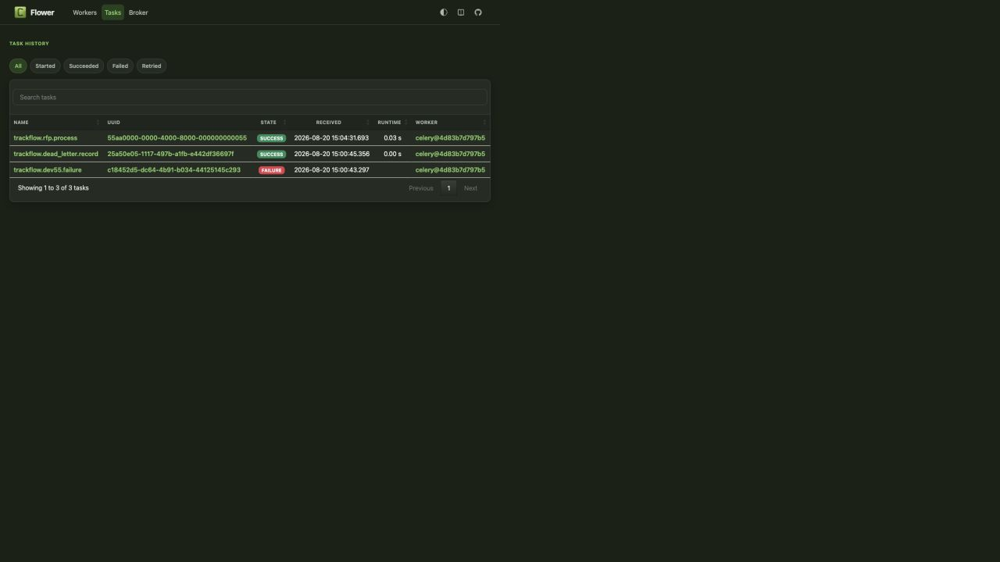

# DEV-55 — Submission-Only Celery Task Queue

## Status and boundary

This specification applies only to branch `codex/async-tasks-dev55`. It is a late coursework
submission, not Engagement 11, not an approved TrackFlow production architecture, and not intended
to merge into `main`. The pull request must remain open and carry an explicit **DO NOT MERGE** notice.

Production deployment is outside scope. In particular, `compose.coolify.yaml`, production
migrations, reporting orchestration, and completed engagement status records remain unchanged.

## Coursework operation

DEV-55 converts the existing slow RFP intake/drafting operation from FastAPI `BackgroundTasks` to
Celery. PDF conversion remains synchronous so raw PDF bytes never enter PostgreSQL or Redis. The API
persists Markdown, publishes only the ticket UUID to Redis, and returns the existing RFP summary with
an additive `task_id` equal to that UUID.

```text
PDF upload -> Central API -> PostgreSQL ticket -> Redis queue -> Celery worker
                    |                              |               |
                    +-> 202 + task_id              |               +-> resumable RFP stages
                                                   +-> Flower events / safe result metadata
terminal failure -> async_task_failures -> dead_letter marker -> idempotent DLQ handler
```

The creation order is persist, enqueue, then realtime publication. If broker publication fails, the
new ticket is deleted and the API returns a safe `503`; this prevents a permanent `analyzing` orphan
and prevents a realtime event for work that was never queued.

## Durable stage and retry contract

The worker chooses work from the persisted ticket status:

| Ticket status | Work resumed |
|---|---|
| `analyzing` | Classify, extract metadata, and route departments |
| `drafting` | Generate and evaluate department sections |
| `under_evaluation` | Prepare durable approval threads |
| Waiting or terminal state | Return idempotent success without repeating work |

Provider, network, and database stage failures cross the worker boundary as typed retryable errors.
Retries use deterministic one- and two-second delays. Although the Celery task declares
`max_retries=3` for rubric visibility, application logic terminates on execution three: initial
attempt plus two retries. Discarded non-RFPs and already-completed stages are deterministic success.

On the third failure, one `async_task_failures` row is committed, the associated RFP ticket becomes
`failed`, and one marker containing only the failure-record UUID is sent to `dead_letter`. Replayed
terminal callbacks reuse the database record and do not publish a duplicate marker. Task logs contain
only task ID, operation, attempt, status, duration, and a fixed sanitized error.

## HTTP contract

`GET /tasks/{task_id}` requires the normal Central API authentication and verifies ownership through
the associated RFP ticket before consulting Celery state. Missing and non-owned IDs both return
`404`. The public state is restricted to `pending`, `started`, `success`, or `failure`. Successful
results contain only `ticket_id` and current `ticket_status`; all other results are `null`.

## Local-only infrastructure

- Redis `7.2.14-alpine` is digest-pinned, AOF-backed, `noeviction`, health-checked, and exposed only
  on `127.0.0.1:6379`.
- One single-concurrency worker consumes `rfp`, `dev55`, and `dead_letter` queues using the Central
  API image.
- Flower is exposed only on `127.0.0.1:5555` and stores state in a named volume.
- `REDIS_URL` is both broker and result backend. Celery accepts JSON only, tracks started state,
  emits task events, uses late acknowledgements and worker-loss requeue, prefetches one task, bounds
  result retention, retries broker connections, and enforces soft/hard timeouts.
- `trackflow.dev55.failure` is registered only for non-production evidence and uses the same retry,
  database failure, logging, and dead-letter path as RFP processing.

## Dependency review

| Dependency | Pin | License determination | Use |
|---|---:|---|---|
| [Celery](https://pypi.org/project/celery/5.6.3/) | 5.6.3 | BSD-3-Clause | Task producer, worker, retries, result state |
| [redis-py](https://pypi.org/project/redis/6.4.0/) | 6.4.0 | MIT | Celery Redis transport/backend compatibility |
| [Flower](https://pypi.org/project/flower/2.1.0/) | 2.1.0 | BSD-3-Clause | Local task-event evidence |
| [Redis](https://redis.io/legal/licenses/) image | 7.2.14-alpine + digest | BSD-3-Clause for Redis 7.2 | Local broker/backend |

These are permissive dependencies, so the repository compliance standard covers them through the
generated full-tree license audit rather than individual `THIRD_PARTY_LICENSES.md` entries. The PR
verification record must include the dependency vulnerability audit, full transitive license scan,
and the upstream Redis 7.2 security-fix review. Redis lists 7.2.14 among the fixed OSS releases for
the reviewed 2026 vulnerabilities in its
[security advisory](https://redis.io/blog/security-advisory-cve202623479-cve202625243-cve-2026-25588-cve202625589-cve-2026-23631/).
The queue safety settings follow the documented
[Celery configuration contract](https://docs.celeryq.dev/en/stable/userguide/configuration.html).

## Acceptance evidence

The submission is ready when the following are attached to the unmerged PR:

1. A real RFP upload returning `202` with `task_id`, followed through the four-state task endpoint to
   safe success metadata.
2. Proof the worker completes queued RFP work independently of the API process.
3. Three deterministic development-task executions with increasing retry delays, one terminal
   database row, and one handled dead-letter marker.
4. A sanitized Flower screenshot showing successful RFP processing, the failed demo task, and the
   dead-letter handler.
5. A sanitized retry log excerpt and the complete release-gate results.

No credential, PDF/Markdown content, prompt, provider payload, client identity, or personal data may
appear in the screenshot, logs, Redis result, PR body, or committed evidence.

## Local runtime evidence — 2026-08-20

The containerized Redis, worker, and persistent Flower topology started successfully. The worker
registered the `rfp`, `dev55`, and `dead_letter` tasks. A content-free terminal RFP ticket proved the
idempotent success path; the development task retried after one and two seconds, failed on execution
three, produced one database row, and invoked one successful dead-letter handler.



The provider-backed RFP upload is intentionally still pending. Executing it would transmit the seed
document to configured external AI providers, so it requires separate confirmation at execution
time. The committed API tests cover the real PDF upload/`202`/task-ID boundary without transmitting
document content externally.

## Verification record — 2026-08-20

| Gate | Result |
|---|---|
| Central API Ruff | Passed |
| Central API strict mypy | Passed, 112 source files; run with a temporary NumPy 2.3.5 overlay because the lock's unchanged NumPy 2.4/2.5 stubs use Python 3.12-only syntax under the repository's Python 3.11 mypy target |
| Central API test/coverage | Passed, 440 tests and 90.40% branch coverage; focused DEV-55 suite passed 14 tests |
| Migration | `0019` upgrade, downgrade to `0018`, re-upgrade, and `alembic check` passed on disposable PostgreSQL |
| Python package | Source distribution and wheel build passed |
| Back Office | Type-check, lint, build passed; final suite passed 180 tests |
| Compose | Tracked local and unchanged production files both validated |
| New dependency licenses | Direct and relevant transitive scan passed; all BSD, MIT, or Apache-family |
| Whitespace | `git diff --check` passed |

`pip-audit` was executed and reported nine findings in five packages already locked at the same
versions on `main`: `cryptography`, `ecdsa`, `h2`, `pyasn1`, and `weasyprint`. None belongs to the new
Celery/Redis/Flower dependency tree. Because this branch is an unmerged coursework submission, those
unrelated upgrades were not folded into DEV-55; the PR must report the findings rather than claiming
a clean vulnerability audit.
