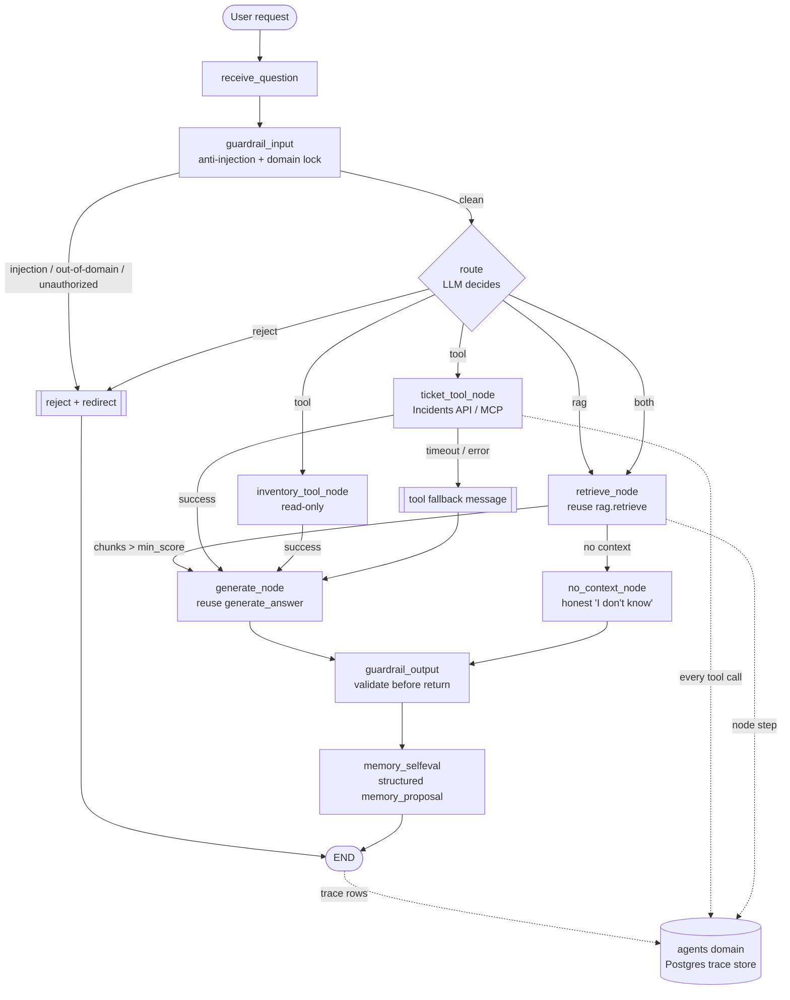

# Engagement 8 — Agent Engineering (LangGraph): Design & Proposed Spec

> **Status:** Proposed spec / design. Engagement 8 has **no owner-approved spec** yet; per
> `docs/planning/remaining_planning/README.md`, this document is the analysis + proposed spec.
> Concepts for newcomers live in [`langgraph-explainer.md`](./langgraph-explainer.md). The
> Engagement 7 predecessor is documented in [`../rag/rag-design.md`](../rag/rag-design.md).

## Context

Engagement 7 delivered a RAG knowledge assistant, but `POST /knowledge/query` runs
`retrieve → generate` inside one opaque `query()` call — a black box. You cannot see the reasoning
path, add live-data tools without entangling them with retrieval, or evaluate the flow independently
of the answer. Engagement 8 turns that into an **explicit, traceable LangGraph agent** and grows it
into a governed CX agent for Valentina Cruz's team (B2B brands + B2C recipients, US and Spain).

The engagement has five sequenced parts (the ordering is a real dependency — 8 reuses 7, and
guardrails must precede memory):

1. **LangGraph migration (01)** — make the RAG flow an explicit graph with a queryable trace per run.
2. **Tools (02)** — add live operational data (support-ticket lookup required, inventory stretch).
3. **MCP server + OAuth (03)** — extract tools into an OAuth-protected MCP server; agent becomes a client.
4. **Guardrails (04)** — domain-locking, anti-injection, output validation, block observability.
5. **Memory (05)** — persistent, human-confirmed, poisoning-resistant conversational memory.

## Locked technology decisions

| Concern | Choice | Rationale |
|---|---|---|
| Graph runtime | LangGraph + `langchain-core` | MIT; confirm version + scan transitive deps (`pip-licenses`). |
| Agent LLM | OpenAI `gpt-4o-mini` (existing key) | Already-configured provider ⇒ no compliance escalation. |
| RAG reuse | `data.pipelines.rag.retrieve` + new `generate_answer` | No retrieval/generation duplicated. |
| Trace store | Self-hosted Postgres, new central-api `agents` domain (SQLModel + Alembic) | We own retention/PII; no data leaves the box. |
| Off-path writes | `domains/telemetry/recorder.py` BackgroundTask pattern | Trace capture never blocks/breaks the request path. |
| MCP server | Python + FastMCP under `mcps/`, auth via `mcpauth` (**not** FastMCP built-in) | Assignment mandate. |
| Memory store | Postgres structured rows (carrier+country) + audit-log table | Fits consolidation + audit; no new infra. |
| CI LLM/tools | Mocked in unit tests; live evals manual/opt-in | Mirrors RAG `rag_eval.py`. |

**No LangSmith / external tracing** — avoids an external service receiving prompts/traces.

## LangGraph architecture

### State (minimal, explicit — not full chat history)

`AgentState`: `question`, `user_context` (sanitized, no raw creds), `route`
(`rag|tool|both|reject|end`), `retrieved` (chunks+scores, passed to generation so retrieval isn't
re-run), `tool_calls`, `answer`, `guardrail_flags`, `memory_proposal`, `trace_id`. Checkpointing at
each meaningful transition; the compiled graph fails clearly on structural errors before execution.

### Nodes

`receive_question` → `guardrail_input` → `route` (LLM) → `retrieve_node` / `ticket_tool_node` /
`inventory_tool_node` → `generate_node` (or `no_context_node`) → `guardrail_output` →
`memory_selfeval` → `END`. Each node is single-responsibility. `retrieve_node` reuses
`rag.retrieve`; `generate_node` reuses the new `generate_answer(question, context_chunks)` factored
out of `query()`.

### Edges & conditional routing

- `guardrail_input`: injection/out-of-domain/unauthorized ⇒ reject; else ⇒ `route`.
- `route`: `rag`→retrieve, `tool`→tool node, `both`→retrieve then tool, `reject`→END.
- `retrieve_node`: chunks above `min_score` ⇒ generate; none ⇒ `no_context_node`.
- `ticket_tool_node`: success ⇒ generate; timeout/error ⇒ fallback message.

The trace must show whether RAG, a tool, or both ran and in what order.

### Diagram

## Trace / observability data model

Three tables in the `agents` domain (SQLModel `table=True`, UTC timestamps, DB constraints/indexes,
Alembic migration chained off the current head, model imported in `migrations/env.py`):

- **`agent_run`** — `id`, `trace_id` (unique), `agent_name`, `env`, `status`, `route_taken`,
  `started_at`, `ended_at`, `duration_ms`, `total_tokens`, `total_cost_usd`, `input_summary`,
  `output_summary`, `guardrail_trigger_count`, `created_at`.
- **`node_step`** — `id`, `run_id` FK, `parent_step_id`, `node_name`, `sequence`, `status`,
  `started_at`, `ended_at`, `duration_ms`, `tokens`, `cost_usd`, `notes`.
- **`tool_call`** — `id`, `run_id` FK, `step_id` FK, `tool_name`, `status`
  (`ok|timeout|error|denied`), `duration_ms`, `input_summary`, `output_summary`, `error_type`,
  `created_at`.

**Safety (telemetry standard §8/§4):** safe metadata only by default; `*_summary` columns are
redacted/truncated — never raw prompts, completions, retrieved text, tool arguments, secrets,
addresses, or carrier rates. Written off the request path via a `recorder.py`-style BackgroundTask
that swallows sink failures. **Retention: 7 days** via a bounded `delete_before(cutoff)` on a
scheduled runner; local/CI traces never enter the prod store; tenant scoping on every access path.

**Exposure:** `GET /agents/runs` (paginated, filterable) and `GET /agents/runs/{trace_id}` (nested
node steps + tool calls), read auth via `current_principal`. Feeds the Agent OS dashboard.

## MCP server (Part 03)

New top-level `mcps/` uv project, Python + FastMCP. **`mcpauth`** mounts Protected Resource Metadata,
validates bearer JWTs against an OAuth 2.1/OIDC provider, rejects unauthenticated access; least
privilege via `required_scopes`; every tool invocation logged. Tools: **ticket** (create/update/check
— status via `PATCH /api/incidents/{id}/status`), **inventory** (read-only; writes explicitly
rejected). Each ships discovery docs. **Transport: Streamable HTTP** (validation via the public
Codespaces-forwarded URL in MCP Playground). Agent migrates to it via `langchain-mcp-adapters` and the
direct incident path is removed (no two paths to the Incidents Manager).

## Guardrails (Part 04 — before memory)

Multiple layers: secure system prompt (system/user separation; un-modifiable; ≥3 documented jailbreak
variants); content/scope (decline+redirect personal-chatbot use); anti-injection (isolate tool/RAG
text; reject instruction-change in ≥3 phrasings); authorization (non-session order ⇒ authz failure,
not "no data"); country-policy non-mixing (US vs Spain); output validation (no leaked instructions or
sensitive context). Log every block/redirect by type (structural/content/security); expose a
trigger-count summary. An automated test **fails the build if the agent obeys** the mandated injection
cases.

## Memory (Part 05 — after guardrails)

Postgres structured rows consolidated by carrier+country (8×2), with an explicit read/write interface
(no system-prompt accumulation). **Never stored** (B2B & B2C): exact addresses, warehouse routes,
single non-repeating incidents, active contract-negotiation data. `memory_selfeval` emits a structured
`memory_proposal` in the same model call as the answer (no second model); most runs ⇒ "nothing to
remember". When memorable, the agent **proposes** in-conversation and never writes directly. The next
message is classified approve/reject/edit (reuse the guardrails intent classifier); one pending
proposal at a time; silence/ambiguity/topic-change ⇒ discard; every decision logged to an audit table.
Poisoning is bounded because guardrails run first + human confirmation + the never-store rule.

## Phases (each ends with an owner-review pause)

0. **Folder reorg** (shared `tests/`, `data/eval/`, `docs/` — isolated PR, green CI). **Done.**
   `tests/pipelines/` categorised into `business_performance/`, `sales_forecasting/`, `rag/`,
   `agents/`. The graded/spec-pinned root paths (`test_pipeline.py` — M6 milestone;
   `test_sales_forecasting.py` — approved spec 6.5; `test_rag.py` — Eng 7) are preserved as
   importlib **re-export shims** at `tests/pipelines/`, kept out of recursive collection via
   `collect_ignore` in the conftest, so `pytest tests/pipelines` collects each real test once while
   explicit `pytest tests/pipelines/test_pipeline.py` still works. `testpaths` and the CI command
   target the subfolders directly. `data/eval/` only carves out `rag/test-queries.json`; the
   Engagement 6.5 `sales_forecast_*` + `evaluation_report.md` artifacts stay at the `data/eval/`
   root because the **binding approved spec 6.5 pins that location** (precedence rule #1). `docs/`
   gains `docs/agents/` (this doc + the explainer); `docs/rag/` left in place.
1. **LangGraph migration** — extract `generate_answer`, build graph, `POST /agent/query`, trace store,
   ≥3 mocked-CI evals incl. grounding; RAG tests still pass. PR label `part-1-langgraph`.
2. **Tools** — ticket (required) + inventory (stretch); routing; ≥2 routing evals. **Done** (ticket
   tool + OpenAI routing with heuristic fallback; tool result folded into generation; tool_call
   traces; inventory stretch tool deferred). In-process `IncidentService` call (live data), swapped
   for the MCP server in Part 3.
3. **MCP + OAuth** — `mcps/` server; migrate agent; remove direct path; validate in MCP Playground.
4. **Guardrails** — multi-layer + injection build-test. (Before Phase 5.)
5. **Memory** — structured store + confirmation + audit; ≥2 full cycles. Branch `w23-d67-agent-memory`.
6. **Agent OS dashboard** — real observability UI over the trace store.

## Verification

Run `POST /agent/query` (RAG path + tool path), watch the trace in Agent OS, confirm no raw
prompt/secret in Postgres. Unit tests mock LLM+tools and assert routing, grounding, injection-blocking,
authz rejection, country non-mixing, a memory cycle, and that traces emit expected metadata while
omitting forbidden data. Live evals + MCP Playground flows are manual/opt-in.
