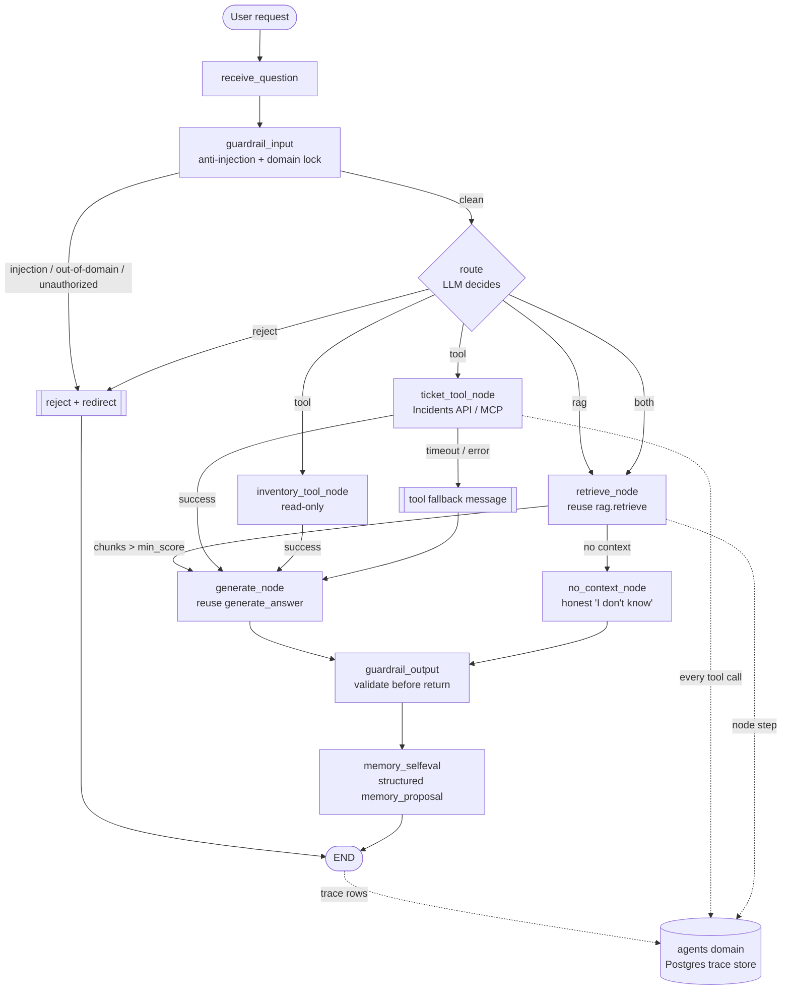

# A Beginner's Guide to LangGraph (TrackFlow Engagement 8)

> Audience: someone who has never used LangGraph. No code required to read this — it explains
> the concepts and how they map onto TrackFlow's agent. For the full architecture and the
> implementation plan, see [`agent-design.md`](./agent-design.md).

## What LangGraph is

LangGraph is a small framework for building an LLM application as a **graph** (a state machine)
instead of one long function. You describe **what steps exist** (nodes), **how the app moves
between them** (edges), and **what data travels between them** (state). LangGraph then runs the
machine: it starts at the entry node, moves along edges — sometimes *choosing* which edge based on
the data — and stops at an end node.

The point is that the path is **explicit and inspectable**: you can trace exactly which steps ran,
in what order, and why. That is the whole reason Engagement 8 exists — Engagement 7's RAG assistant
works, but it's a black box, and we want an agent we can see, evaluate, and safely extend.

## The five ideas, from zero

- **State** — a shared "clipboard" that every step can read and write. In our agent it holds the
  question, retrieved chunks, tool results, the answer, and a trace id. We keep it **minimal**
  (not the whole chat history) so each step's job is clear.
- **Node** — one step that does one thing: e.g. "retrieve documents", "call the ticket tool",
  "generate the answer". A node receives the state, does its job, and returns an updated state.
  Single responsibility keeps the graph traceable.
- **Edge** — a connection saying "after node A, go to node B". A plain edge is unconditional.
- **Conditional routing (conditional edge)** — an edge with a decision. After the "route" node,
  the app looks at the state and *chooses*: go to retrieval, go to a tool, do both, or reject.
  This is the difference between a fixed pipeline and an **agent** that decides what to do.
- **Tool** — a function the agent can call to get **live** information or take an action (look up a
  ticket's current status, read stock). Unlike the knowledge base (stable documents), a tool
  returns the *current* value. The LLM decides *when* to call a tool; the tool node actually runs
  it, with a timeout and a safe fallback if it fails.

## How a request flows through the graph

1. The request enters at `receive_question`; we validate it and attach a trace id.
2. A **guardrail** node checks for prompt-injection and off-domain/unauthorized requests; bad input
   is rejected and redirected.
3. The **route** node (the LLM) decides: is this a knowledge question (RAG), a live-data question
   (tool), both, or something to reject?
4. Depending on that decision, the app follows a **conditional edge** to retrieval and/or a tool node.
5. Results land back on the state; the **generate** node writes a grounded answer (reusing
   Engagement 7's generation). If retrieval found nothing, an honest "I don't know" node runs instead.
6. An **output guardrail** validates the answer; a **memory self-eval** step decides whether anything
   is worth remembering (and if so, *proposes* it to the user). Then `END`.

## How tool calls happen

The LLM doesn't run code itself. When the route node decides a tool is needed, the graph moves to a
tool node that calls the real endpoint (the Incidents Manager, later through the MCP server), with a
**timeout** and a **fallback**. The tool's typed result is written back to the state, and generation
uses it. Every tool call re-checks authorization on the server — the model never gets to assert
"I'm allowed".

## How this differs from Engagement 7 (RAG) and from a single LLM call

- **A plain single LLM call** is: prompt in, text out. No steps, no live data, no branching, and
  nothing to inspect afterward.
- **The Engagement 7 RAG pipeline** is a *fixed* two-step: retrieve, then generate — always in that
  order, inside one `query()` function. It's a straight line and a black box: you can't see the steps
  or add a live-data tool without tangling it.
- **The LangGraph agent** makes those steps explicit **and** adds a decision: it can retrieve, call a
  tool, do both, or refuse — chosen at runtime — and every run leaves a trace you can open and
  evaluate. RAG becomes *one branch* of a larger, observable graph. (We deliberately reuse
  Engagement 7's `retrieve()` and `generate_answer()` as nodes — no duplicated logic.)

## How tracing/observability maps onto the graph

Each **run** of the graph = one `agent_run` record. Each **node** that executes = a `node_step`
(with timing, tokens, cost, status). Each **tool** invocation = a `tool_call` (with status and
latency). A shared `trace_id` links them, so the Agent OS dashboard can redraw the exact node/edge
path a request took — like a flight tracker for the graph. We store **safe metadata only** (timings,
token counts, statuses, redacted summaries) — never raw prompts, secrets, addresses, or carrier
rates.

## The architecture, as a diagram

## Glossary

- **Agent** — an LLM app that decides its own next step (which tool, which branch), not just answers.
- **Graph / state machine** — the set of nodes + edges the app runs through.
- **Node** — one single-responsibility step.
- **Edge** — a transition between nodes; a **conditional edge** chooses based on state.
- **State** — the shared data passed between nodes.
- **Tool** — a callable for live data/actions, with timeout + fallback.
- **RAG** — retrieval-augmented generation; fetch relevant documents, then answer from them
  (stable knowledge).
- **Routing** — the decision of which branch to take (RAG / tool / both / reject).
- **Checkpoint** — a saved state snapshot at a transition, so a run can be inspected/resumed.
- **Trace / run / node step / tool call** — the observability records; a `trace_id` links them.
- **Guardrail** — a check that blocks injection, off-domain, unauthorized, or unsafe input/output.
- **MCP server** — an independent, OAuth-protected service that exposes tools for any agent to
  discover and call.
- **Memory (agent)** — persistent, human-confirmed facts the agent carries across conversations
  (distinct from the RAG knowledge base).
