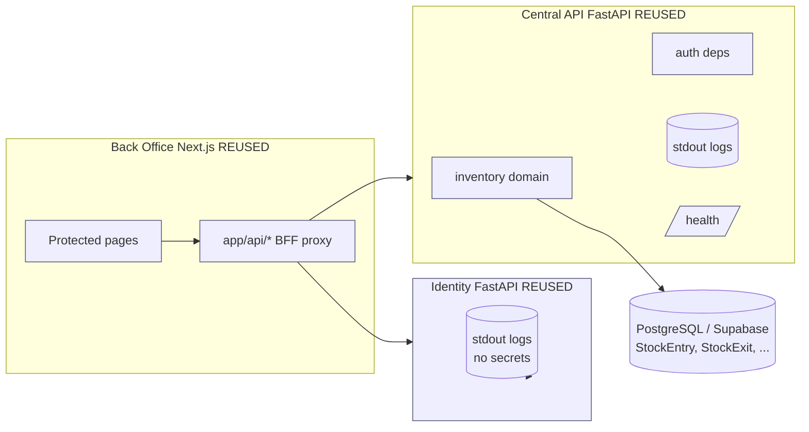
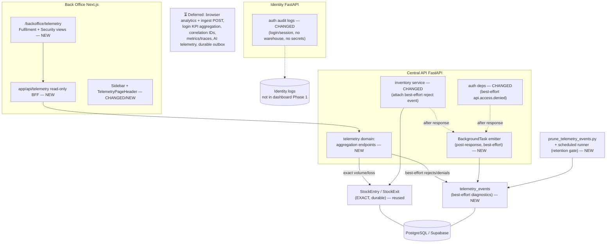

# Engagement 6 — Data Pipelines & Telemetry: Initialization + Implementation Plan (Rev 3)

## Context

TrackFlow's Back Office and Central API are in production, but leadership (Thomas Harry, CEO; Ana Whitfield, Head of Warehouse Ops) keep asking operational questions the platform cannot answer: dispatch volume and failures per warehouse, stock lost as loss, and whether protected APIs are being probed. Engagement 6 delivers a **first valuable, server-authoritative telemetry slice** with an honest, single delivery guarantee, plus a Back Office route to read it.

**Verified baseline (the repo is the source of truth, not the four context files):**
- **No telemetry code exists.** What exists: Python `logging` with `key=value` context; Central API `/health` DB probe (`main.py:95`); container health checks; identity tests asserting secrets never appear in logs.
- **Real inventory schema:** warehouses `LA`/`ZGZ`; entities `SKU`/`StockEntry`/`StockExit`; outbound (`StockExitCreate`) has `exit_type` (`dispatch`/`loss`), `tracking_number`, `warehouse`, `sku_id`, `quantity` — **no `destination_country`, no `client_id`**. Movements persist `user_uuid`. **Successful movements are durably persisted (system of record); rejections raise `InventoryError` and are not persisted anywhere today.**
- **Central API** modular monolith (`models/repository/schemas/service/router` per domain + Alembic); auth via `current_principal` / `write_principal` in `core/dependencies.py`.
- **Auth verifier boundary (`packages/trackflow_auth/verifier.py`):** `authenticate_request` normalizes **all** token problems (missing, malformed, expired, wrong issuer/audience/alg, missing claims, inactive) to one non-enumerating `401 "Not authenticated"`. Only two failure kinds are separately observable at the Central API layer **without changing the verifier**: `403 "Password change required"` and `403 "CSRF token missing or invalid"` (from `require_csrf`).
- **Identity** owns login; **no warehouse assignment/claim**. **No scheduler/cron infrastructure exists** in the repo yet.
- **Navigation precedent (reuse, do not invent):** `BackofficeNavigation.tsx` sidebar (`icon` is a **Lucide component reference**, e.g. `icon: Boxes`) + `InventoryPageHeader.tsx` segmented sub-nav. BFF: `app/api/<domain>/[[...path]]/route.ts` allowlist → `proxyRequest(centralAPIURL())`.

**Confirmed product decisions:** reporting is visible to **all authenticated Back Office users** (`current_principal`, matching `/incidents/summary`); **Phase 1 = inventory fulfilment + a security/integrity view**, both server-owned; **no browser telemetry in Phase 1**.

**Scope of THIS task:** engagement initialization (brief + tracking updates) + this decision-complete plan + **one permitted repository write**: `docs/runbooks/telemetry-inventory.md` and its runbooks-index link. No code/dashboard/instrumentation/infra is implemented.

---

## Part A — Engagement 6 Initialization (execute after approval)

Per `.agents/skills/start-engagement/SKILL.md`:
1. **Create `docs/briefs/06-data-pipelines-telemetry.md`** — full stakeholder brief, voice/depth of `05-backend-inventory-management.md`; stakeholder **Andrés Kim (CTO)**, KPI consumers Thomas Harry & Ana Whitfield. Sections: Title; `## Client: TrackFlow · Stakeholder: Andrés Kim (CTO)`; `## Status` (`In progress — Engagement 6.`); Background; Stakeholder Request (quoted); Assignment; What You're Building; Acceptance Criteria; Out of Scope (no metrics/tracing/APM backend, no browser analytics, no AI telemetry, no correlation-ID platform, no durable event queue in Phase 1).
2. `docs/briefs/README.md` — row `06 | Data Pipelines & Telemetry | Andrés Kim, CTO | 🚧 In progress | services/central-api/ (telemetry domain), uis/backoffice/`.
3. `README.md` — roadmap row 6 → `🚧 In progress`.
4. `CLAUDE.md` — Engagement 6 entry under "Where New Engagement Code Goes".
5. `memory-bank/progress.md` — move Engagement 6 to **Active**.

---

## Part B — Telemetry Implementation Plan (decision-complete)

### B1. The single Phase 1 delivery guarantee (stated plainly)

Phase 1 deliberately does **not** attempt "exact KPIs + zero lost events + zero request-path effect + no durable delivery infrastructure" simultaneously. The chosen tradeoff:

- **Exact, durable metrics come from the business system of record.** Dispatch volume, receiving volume, and stock-loss are computed with read-only SQL `GROUP BY` directly over `StockExit`/`StockEntry`. These are exact and reconcilable; they require **no telemetry events** and add nothing to any write path.
- **Rejections and access-denials are best-effort diagnostics.** `inventory.dispatch.rejected` and `api.access.denied` are emitted **after the HTTP response is sent** via a Starlette `BackgroundTask` attached to the error response — so there is **no synchronous telemetry-only round trip on the business request path** (honoring `telemetry-standard.md` §6 without needing a documented exception). Best-effort means: **these events can be lost on a crash/restart before the background task runs, and are not guaranteed complete.**
- Therefore the **dispatch failure rate is presented as a diagnostic, not an exact KPI.** The dashboard shows exact dispatch volume (business record) alongside a best-effort rejected-attempt count/trend, and an **indicative** failure ratio explicitly labeled "diagnostic — best-effort, may undercount." No metric that must be exact is built on best-effort telemetry.

A durable outbox/queue (making rejections a first-class, loss-free audit record) is a **deferred** option, called out below.

### B2. Fulfilment metrics — vocabulary and definitions

Server-owned inventory vocabulary only (`inbound`/`receiving` = `StockEntry`; `dispatch`/`loss` = `StockExit.exit_type`). No `destination_country`, no `client_id`.

| Metric | Source | Guarantee |
|---|---|---|
| Dispatch volume /day/warehouse | `StockExit` where `exit_type=dispatch` | **Exact** |
| Receiving volume /day/warehouse | `StockEntry` | **Exact** |
| Stock-loss count + units /day/warehouse | `StockExit` where `exit_type=loss` | **Exact** |
| Rejected dispatch attempts /day/warehouse (`reason_code` ∈ `INSUFFICIENT_STOCK`, `SKU_NOT_FOUND`, `WAREHOUSE_MISMATCH`) | `telemetry_events` (`inventory.dispatch.rejected`) | **Best-effort diagnostic** |
| Indicative dispatch failure ratio = `rejected / (dispatch_volume + rejected)` | mixed | **Diagnostic only, labeled** |

Explicitly out of the numbers: client-side form validation (never reaches the server), HTTP 422 request-validation (malformed request, not a business outcome), and `503` persistence failures (infrastructure). These are documented exclusions, not silent drops.

### B3. Emission mechanism — off the request path, best-effort

- The Central API route/exception handler attaches a Starlette `BackgroundTask` to the outgoing error response; the task inserts one `telemetry_events` row in its own short-lived session, wrapped in `try/except` that logs `WARNING` and swallows. It runs **after** the response, so it never adds latency to or can fail the business operation.
- `InventoryError` is extended with a safe structured `reason_code` and the attempted `warehouse`/`exit_type` (all non-PII) so the rejection event can be assembled at the boundary without new payload inspection.
- `TELEMETRY_ENABLED=false` disables all emission (fail-open to normal operation). No success events are emitted — exact volumes come from business tables.

### B4. Authentication telemetry — corrected

- **Failed logins never create a `telemetry_events` row.** Phase 1 auth telemetry = **Identity-owned safe audit logs only**: structured `auth.login.succeeded` / `auth.login.failed` (safe `reason`) / `auth.session.expired` log lines from `services/identity/`, who/what/when/outcome, **no email, password, token, or warehouse**, covered by `caplog` tests like `test_password_reset.py`. Not a dashboard KPI in Phase 1.
- **Central API access-denials are a separate, server-observed signal.** `api.access.denied` best-effort events are emitted at the `core/dependencies.py` boundary when a protected request is refused. Reasons are limited to what the verifier **actually** distinguishes without any verifier change and without weakening the non-enumerating external response:
  - `unauthenticated` — the single normalized `401` (covers missing/expired/malformed/inactive; **not** separately enumerated).
  - `password_change_required` — the `403` from the `must_change_password` branch.
  - `csrf` — the `403` from `require_csrf`.
  - Stored `properties`: `{reason}` only. **No path, no token, no actor, no email.** A dashboard-backed login KPI and finer token-failure categories are **deferred** (the latter would require a reviewed verifier change that preserves non-enumerating responses plus tests — out of Phase 1).

### B5. Storage, schema & retention

- **One PostgreSQL table `telemetry_events`** in the existing Central API (Supabase) DB. New `telemetry` domain (`models/repository/schemas/service/router.py`) + Alembic `20260709_0004_telemetry_events.py` per `database-engineering-standard.md`. The table stores **only best-effort diagnostics** (`inventory.dispatch.rejected`, `api.access.denied`) — exact metrics live in the business tables.
- Columns: `id` PK; `event` text (indexed); `category` (`operational` | `security`); `occurred_at` timestamptz UTC (indexed); `service`; `env`; `severity`; `warehouse` nullable (`LA`/`ZGZ`, inventory events only); `reason_code` nullable; `value` nullable int (`quantity`, queryable); `properties` JSONB (allowlisted). Indexes `(event, occurred_at)`, `(event, warehouse, occurred_at)`.
- **Property allowlists** (unknown keys rejected before insert; `properties` never a metric label — cardinality-safe):
  - `inventory.dispatch.rejected`: `{warehouse, reason_code, quantity?}`
  - `api.access.denied`: `{reason}` (`unauthenticated` | `csrf` | `password_change_required`)
- **Never stored:** emails, names, recipient data, tokens, secrets, free text, `client_id`, request paths.
- **Retention (defined and enforced before production collection):** `operational` = 90 days, `security` = 365 days (distinct). Mechanism: `services/central-api/scripts/prune_telemetry_events.py` (mirrors `scripts/import_suppliers_from_tinydb.py`), env-configurable windows. **Enforcement gate:** the prune command **must be wired to a scheduled runner (Coolify scheduled task / cron) before `TELEMETRY_ENABLED=true` in production**; if scheduling is not ready at cutover, a **time-bounded documented exception** — owner **Andrés Kim (CTO)**, deadline **30 days from Phase 1 production enablement** — is recorded in the brief, the runbook, and `telemetry-inventory.md`. No open-ended unbounded collection.

### B6. Reporting API contract (complete)

Read-only aggregation endpoints, `current_principal` (any authenticated user), **aggregates only — raw event rows are never exposed**. Volume queries read business tables (exact); rejection/denial queries read `telemetry_events` (best-effort). All timestamps UTC; days are **UTC calendar days** (documented; local-day bucketing per warehouse is a noted refinement).

Shared query rules (every endpoint): `from`/`to` are **required** `YYYY-MM-DD`, validated (parseable, `from <= to`, `(to-from) <= 92 days`) → else `400`; aggregation via SQL `GROUP BY`; rows with null `warehouse` excluded from warehouse-segmented metrics; empty range → `200` with echoed `period` and `rows: []`.

- `GET /telemetry/metrics/dispatch?from&to` → `{ period, rows:[{ date, warehouse, dispatched, rejected, indicative_failure_rate }] }` where `dispatched` is **exact** (StockExit), `rejected` is **best-effort** (telemetry), `indicative_failure_rate = round(rejected/(dispatched+rejected),4)` (`0.0` if denom `0`), response documents `rejected` as best-effort.
- `GET /telemetry/metrics/receiving?from&to` → `{ period, rows:[{ date, warehouse, count }] }` (exact).
- `GET /telemetry/metrics/stock-loss?from&to` → `{ period, rows:[{ date, warehouse, count, units }] }` (exact).
- `GET /telemetry/metrics/access-denials?from&to` → `{ period, rows:[{ date, reason, count }] }` (best-effort; no warehouse, no actor).

### B7. Back Office route, navigation, views, states, authz

- **Route (approved structure):** one sidebar item, two segmented subviews.
  - `app/(protected)/backoffice/telemetry/` → redirects to `fulfilment`.
  - `.../telemetry/fulfilment/page.tsx` — exact dispatch/receiving volume + best-effort rejected-dispatch diagnostic + labeled indicative failure ratio, by warehouse/day.
  - `.../telemetry/security/page.tsx` — access-denials by reason/day + exact stock-loss by warehouse/day + a labeled note that login audit is Identity-owned logs (KPI deferred).
- **Navigation (reuse both patterns; no new idiom):**
  1. `BackofficeNavigation.tsx`: add `{ label: "Telemetry", href: "/backoffice/telemetry/fulfilment", icon: Activity, activePrefix: "/backoffice/telemetry" }` — `icon` is a **Lucide component reference** (`Activity`), exactly like `icon: Boxes`. Not JSX.
  2. `components/telemetry/TelemetryPageHeader.tsx`: a direct clone of `InventoryPageHeader.tsx` segmented sub-nav (Fulfilment / Security).
- **Visualization (decided now):** **existing components only** — `StatCard` for headline numbers + accessible HTML tables/metric cards for breakdowns. **No new charting dependency** in Phase 1 (no new dep/tests, no `dataviz`-skill dependency); charts are a Phase 2 enhancement. Best-effort figures are visually badged "diagnostic."
- **Data / fetching:** `lib/telemetry/types.ts` + `lib/telemetry/api.ts` (typed GET fetchers → read-only telemetry BFF), mirroring `lib/inventory/`; default last 7 days with a range control.
- **States:** spinner/skeleton loading; explicit empty ("No telemetry in this range"); typed errors via `app/(protected)/error.tsx`.
- **Authorization:** protected layout enforces auth; endpoints use `current_principal`; no raw rows, no PII returned.

### B8. Package ownership (resolved)

- **Server registry/allowlists in Central API** (`central_api/domains/telemetry/`, Python). **Back Office read types in `uis/backoffice/lib/telemetry/`** (TS). **`packages/shared/` is not modified** (protected). No shared cross-language event artifact in Phase 1 — there is no browser producer, so events have a single Python producer. Revisit only if Phase 2 adds browser ingestion.

### B9. Architecture diagrams

**Current state (today):**

*No telemetry store, no metrics/traces/correlation IDs, no reporting endpoints today.*

**Proposed Phase 1** (labels: **NEW**, **CHANGED**, *reused*, ⏳deferred):

Delivery guarantee visible: exact metrics flow from `StockEntry`/`StockExit`; only best-effort diagnostics flow through the post-response emitter into `telemetry_events`; retention is enforced by a scheduled prune gate.

### B10. Required changes by area (Phase 1)

- **Central API:** new `telemetry` domain (models/repository/schemas/service/router) — aggregation endpoints querying business tables (exact) + `telemetry_events` (best-effort); Alembic `0004`; register router in `main.py`; extend `InventoryError` with safe `reason_code`/attempted `warehouse`/`exit_type`; attach post-response `BackgroundTask` emitters in the inventory error path (`service.py`/handlers) and auth-deny path (`core/dependencies.py`); `scripts/prune_telemetry_events.py`; `core/config.py` + `.env.example` add `TELEMETRY_ENABLED`, `TELEMETRY_OPERATIONAL_RETENTION_DAYS=90`, `TELEMETRY_SECURITY_RETENTION_DAYS=365`.
- **Identity:** structured safe auth-audit log lines; `caplog` tests asserting no email/password/token/warehouse.
- **Back Office:** read-only `app/api/telemetry/[[...path]]/route.ts` (allowlist the four `GET metrics/*` paths only); `components/telemetry/TelemetryPageHeader.tsx` + `fulfilment`/`security` views (StatCard + tables); `lib/telemetry/{api,types}.ts`; sidebar nav item.
- **Docs:** update `telemetry-standard.md` §10 to record only what ships; **create `docs/runbooks/telemetry-inventory.md`** (living inventory) + index link; runbook note for the events table, prune job, and retention gate/exception.
- **Tests:** allowlist enforcement + forbidden-field rejection; exact-volume queries reconcile to business rows; best-effort emit does not run on/affect the request path (business op succeeds and returns before/independently of emit; forced emit failure never fails the op); `from/to` validation + max-range + empty-range; aggregates-only (no raw-row endpoint); BFF allowlist rejects non-metrics paths; `api.access.denied` row asserted for an unauthenticated and a CSRF-rejected protected request, with `reason` limited to the derivable set; failed-login asserts an Identity audit log line + absence of email/password/token (no `telemetry_events` row); frontend loading/empty/error tests.

### B11. Phase separation

- **Phase 1:** exact business-table metrics; best-effort post-response rejection/denial diagnostics in `telemetry_events`; Identity auth *logs*; enforced retention (or filed exception); four aggregation endpoints; telemetry route (StatCard/tables); tests + living inventory.
- **Phase 2+ (deferred):** browser product-analytics/navigation events (client `track()` + ingest `POST` BFF + `write_principal` + shared schema); durable outbox/queue for loss-free rejection capture and an exact failure-rate KPI; Identity login-KPI aggregation path (+ warehouse only if the business adds user↔warehouse mapping); receiving→dispatch cycle-time KPI; charting library.
- **Later platform work (not this engagement):** correlation-ID propagation, metrics/tracing backend, AI telemetry (Engagement 7+), external uptime/alerting. Phase 1 must not claim these exist.

### B12. Rollout order, gates, acceptance

**Order:** (1) `telemetry_events` model + Alembic `0004` → (2) telemetry domain + aggregation endpoints (business-table + events queries) → (3) `InventoryError` safe fields + post-response emitters (inventory + auth deny) → (4) read-only BFF + telemetry route + views + nav → (5) Identity auth-audit logs → (6) prune script + **schedule wiring (retention gate)** → (7) enable `TELEMETRY_ENABLED` in prod only after the gate is met or the time-bounded exception is filed.

**Verification gates** (`AGENTS.md` pre-commit + `production-readiness.md`): per-package `type-check/build/lint/test` green (`central-api`, `identity`, `backoffice`); migration `0004` applies+reverts on a disposable DB; end-to-end: a committed dispatch and a committed loss appear **exactly** in the dispatch/stock-loss endpoints from business tables; a rejected dispatch and a CSRF-rejected request each produce (best-effort) exactly one correctly-categorized `telemetry_events` row; a failed login produces an Identity audit log line (no email/password/token) and **no** `telemetry_events` row; a forced emitter failure leaves the business op unaffected; forbidden fields absent; prune removes only past-window rows per category.

**Acceptance criteria:** telemetry route reachable from the sidebar; Fulfilment + Security views render with **exact** volume/loss reconciling to `StockEntry`/`StockExit` and **best-effort** rejected/denial diagnostics clearly labeled as such (no exact KPI is built on best-effort telemetry); no synchronous telemetry round trip added to the business request path; auth Phase 1 is Identity logs only (no warehouse, no `telemetry_events` login rows); `api.access.denied` reasons limited to `unauthenticated`/`csrf`/`password_change_required` with no verifier change; `telemetry_events` has enforced category-distinct retention (or a filed exception with owner+deadline); endpoints aggregates-only with validated `from/to`; brief + `telemetry-standard.md` §10 + `telemetry-inventory.md` + tracking docs reflect only what shipped.

---

## Files (representative)

**Create:** `docs/briefs/06-data-pipelines-telemetry.md`; `docs/runbooks/telemetry-inventory.md` *(permitted now)*; `services/central-api/central_api/domains/telemetry/{models,repository,schemas,service,router}.py`; `.../migrations/versions/20260709_0004_telemetry_events.py`; `.../scripts/prune_telemetry_events.py`; `uis/backoffice/app/api/telemetry/[[...path]]/route.ts`; `uis/backoffice/app/(protected)/backoffice/telemetry/{fulfilment,security}/page.tsx`; `uis/backoffice/components/telemetry/TelemetryPageHeader.tsx` (+ views); `uis/backoffice/lib/telemetry/{api,types}.ts`.

**Edit:** `services/central-api/central_api/main.py`; `.../core/config.py` (+`.env.example`); `.../domains/inventory/{service.py,schemas.py}` (safe reject fields + emit); `.../core/dependencies.py` (deny emit); `services/identity/` auth-audit logs; `uis/backoffice/components/BackofficeNavigation.tsx`; `docs/standards/telemetry-standard.md` §10; `docs/runbooks/README.md` (index link); `README.md`, `docs/briefs/README.md`, `CLAUDE.md`, `memory-bank/progress.md`.

## Verification
Per-package `type-check/build/lint/test`; apply+revert migration `0004`; confirm exact volume/loss reconcile to business rows; confirm rejected-dispatch and CSRF-denied requests each yield one best-effort `telemetry_events` row while a failed login yields only an Identity audit log; confirm a forced emitter failure never affects the business op; confirm forbidden fields absent and prune respects per-category windows.
