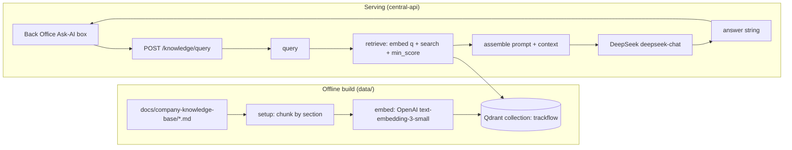

# Engagement 7 — RAG Knowledge Base: Implementation Plan

> **Status:** Proposed spec (planning input, no owner-approved `spec.md` yet). Per
> `docs/planning/remaining_planning/README.md`, a project with no approved spec is not ready to
> implement — this document is the analysis + proposed spec. Implementation is phased with an owner
> review pause after each phase. A companion beginner guide lives at [`rag-explainer.md`](rag-explainer.md).

## Context

Miguel Torres's commercial team (8 account managers / BD reps) keeps re-answering the same prospect
questions — delivery SLAs, returns policy, carrier coverage, storage pricing — that are already
documented but scattered. Engagement 7 builds a **Retrieval-Augmented Generation (RAG)** assistant:
an account manager types a natural-language question and gets a reliable, salesperson-voiced answer
generated **from the retrieved source documents**, never inventing terms and never dumping raw DB
fragments.

The four hard requirements the ticket grades on:

1. Four separated, single-responsibility functions: `setup`, `embed`, `retrieve`, `query`.
2. Answers are always **model-generated from retrieved context** — raw vector hits are never returned.
3. Company-specific values (collection name, payload field names, source docs, business constraints)
   match [`context.md`](context.md) exactly.
4. No orchestration frameworks (no LangChain/LlamaIndex) — the pipeline is written directly against the
   Qdrant SDK + FastAPI.

Beyond the milestone core, the owner wants the Back Office information architecture refactored now
(query box on the home page, grouped category sidebar, top-center Business / Technical-&-Agent-OS
toggle, header account menu, dark mode) modeled on the Hostinger + Agent-OS reference screenshots.

### Decisions locked (owner, 2026-07-29)

| Decision | Choice | Notes |
|---|---|---|
| **Embedding model** | **OpenAI `text-embedding-3-small`** | 1536-dim, cosine distance. Dedicated embeddings API, separate from generation. New provider → apply `.agents/rules/compliance-licensing.md`. |
| **Generation model** | **DeepSeek `deepseek-chat`** | OpenAI-compatible API, key already available. Distinct model ID from the embedder (grading requirement). |
| **Vector store** | **Self-hosted Qdrant container** | Added to `compose.yaml` (local) + `compose.coolify.yaml` (prod). No new managed dependency. |
| **UI scope** | **Full IA refactor now** | Home query box, grouped sidebar, Business/Technical toggle, header account menu, remove "Internal operations" badge, add dark mode. |

---

## Proposed Architecture

Two-plane split that mirrors the existing forecasting (pipeline) + reporting (API) division:

- **Offline / build plane** (`data/`): read source docs → chunk → embed → upsert into Qdrant. The
  `setup` + `embed` functions live here.
- **Online / serving plane** (`services/central-api/`): a new `rag` domain exposes
  `POST /knowledge/query`, which imports and calls `query()` from `data/pipelines/rag.py`. The
  `retrieve` + `query` functions live in the pipelines layer; the router stays thin (no retrieval or
  generation logic duplicated in it), matching the telemetry/reporting domain convention.
- **Vector store**: Qdrant container, collection `trackflow` (name from `context.md`), 1536-dim cosine.
- **Frontend** (`uis/backoffice/`): refactored App-Router shell with a home "Ask your knowledge base"
  box calling the endpoint through the existing `fetchWithAuth` → Next proxy → `centralAPIURL()` pattern.



### Directory tree (new + changed)

```
docs/
  company-knowledge-base/                 # NEW — the indexed corpus (copied from planning folder)
    trackflow-sla-delivery.en.md
    trackflow-returns-policy.en.md
    trackflow-carrier-coverage.en.md
    trackflow-storage-pricing.en.md
  rag/
    rag-design.md                         # NEW — required design doc (+ Mermaid diagram)

data/
  process/
    rag.py                                # NEW — setup() chunking + chunk model (pure logic)
  pipelines/
    rag.py                                # NEW — embed(), retrieve(), query(), Qdrant client, prompt
  eval/
    test-queries.json                     # NEW — >=8 questions across all 4 docs (+ Black Friday)
  pyproject.toml                          # EDIT — add qdrant-client, openai, httpx deps

services/central-api/
  central_api/
    domains/rag/                          # NEW domain
      router.py                           # POST /knowledge/query, thin, auth-gated
      service.py                          # RagService: wraps query(), typed RagError
      schemas.py                          # QueryRequest{question}, QueryResponse{answer}
    core/config.py                        # EDIT — add qdrant_url, openai_api_key, deepseek_* settings
    main.py                               # EDIT — include_router(rag_router) + RagError handler
  scripts/
    rag_index.py                          # NEW — CLI entrypoint that runs setup() (idempotent reindex)
  tests/
    test_rag.py                           # NEW — retrieve()/query() unit tests with mocks
  .env.example                            # EDIT — document new keys

uis/backoffice/                           # Full IA refactor (see Phase 5)
  app/(protected)/page.tsx                # EDIT — home = Ask-AI box (top) + OperationsOverview (below)
  app/(protected)/ask/page.tsx            # NEW — full Ask-AI / knowledge query view (optional deep link)
  app/api/knowledge/[[...path]]/route.ts  # NEW — allow-listed proxy to /knowledge/query
  lib/knowledge/api.ts                    # NEW — askKnowledge() wrapper via fetchWithAuth
  components/
    AppShell.tsx                          # EDIT — header account menu, top-center view toggle
    BackofficeNavigation.tsx              # EDIT — grouped category nav
    knowledge/AskKnowledgeBox.tsx         # NEW — query box + loading/error/answer states
    account/AccountMenu.tsx               # NEW — top-right avatar dropdown
    ViewToggle.tsx                        # NEW — Business / Technical & Agent OS switch
  lib/theme/                              # NEW — dark-mode provider + persistence
  tailwind.config.ts                      # EDIT — darkMode: "class" + dark palette tokens

compose.yaml                              # EDIT — add qdrant service (+ volume)
compose.coolify.yaml                      # EDIT — add qdrant service for production
```

---

## Selected Database / Storage Structure

**Qdrant collection `trackflow`** (self-hosted). Vectors are 1536-dim (OpenAI
`text-embedding-3-small`), **cosine** distance. One point per chunk. Payload uses the **exact field
names from `context.md`** plus `text` (the chunk body, required for prompt assembly per instructions):

```jsonc
{
  "id": "<deterministic uuid5(source_document + chunk_index)>",
  "vector": [/* 1536 floats */],
  "payload": {
    "company": "trackflow",
    "source_document": "sla-delivery | returns-policy | carrier-coverage | storage-pricing",
    "section": "<section title/subtitle>",
    "language": "en",
    "chunk_index": 0,
    "text": "<chunk body>"
  }
}
```

- **Idempotency**: deterministic point IDs (`uuid5` of `source_document:chunk_index`) so re-running
  `setup()` upserts in place and never duplicates. `rag_index.py` supports `--recreate` to drop and
  rebuild the collection cleanly.
- **No Postgres/pgvector changes.** The existing Supabase Postgres and its Alembic migrations are
  untouched — the vector data lives entirely in Qdrant, keeping us clear of the Supabase-Free 500 MB cap.
- Retrieval quality bar: `retrieve()` applies a tuned `min_score` (cosine) and returns **fewer than k,
  or zero**, when nothing clears the bar — satisfying the "don't force k results" grading item and the
  Recall@3 ≥ 80% KPI, validated against `data/eval/test-queries.json`.

---

## Technologies

| Layer | Technology | Rationale |
|---|---|---|
| Vector DB | **Qdrant** (self-hosted, `qdrant-client` SDK) | Mandated by `context.md`; matches its payload schema. |
| Embeddings | **OpenAI `text-embedding-3-small`** (`openai` SDK) | 1536-dim, cheap, high recall; dedicated embeddings model. |
| Generation | **DeepSeek `deepseek-chat`** (OpenAI-compatible via `openai` SDK base_url) | Key available; distinct model ID from embedder. |
| API | **FastAPI + SQLModel** (existing central-api) | New `rag` domain, same router→service pattern. |
| HTTP client | **httpx / openai SDK** | httpx currently dev-only → promote to runtime dep in `data/pyproject.toml`. |
| Config | **pydantic-settings** | Add typed fields; keys via per-service `.env` (git-ignored). |
| Frontend | **Next.js 16 App Router + Tailwind + lucide-react** | Existing stack; add `darkMode: "class"` + theme provider. |
| Tests | **pytest** (backend), **vitest** (frontend) | `retrieve()`/`query()` mocked; no live Qdrant/LLM in CI. |

**Governance to apply at implementation** (from `AGENTS.md` / `CLAUDE.md`):
`.agents/rules/compliance-licensing.md` (OpenAI + DeepSeek are new providers),
`.agents/rules/testing-error-handling-ci.md`, `.agents/rules/authentication-security.md` (endpoint is
auth-gated + the AI-agent user-context note), and `.agents/rules/database-engineering.md` (new store).

---

## Implementation Phases & Development Sequence

Phased with an **owner review pause after each phase** (repo working agreement). Build order follows
the ticket: `setup → embed → retrieve → query → API → UI → tests → docs`.

### Phase 0 — Scaffold & corpus
- New branch. Copy the four source docs into `docs/company-knowledge-base/` with the `context.md`
  filenames (`trackflow-sla-delivery.en.md`, etc. — the on-disk planning names differ).
- Add `qdrant` to `compose.yaml`; confirm connectivity from Python. Add `qdrant-client`, `openai`,
  `httpx` to `data/pyproject.toml` via `uv add`. Add settings fields + `.env.example` entries.

### Phase 1 — Data prep & indexing (`data/process/rag.py`)
- `setup()`: read the four docs, **chunk by semantic section** (heading/paragraph-group), never
  splitting a rule or condition. Each doc → ≥ 3 self-contained chunks. Attach payload metadata.
- Create/recreate the `trackflow` Qdrant collection (1536-dim, cosine) and upsert with deterministic
  IDs (idempotent). `scripts/rag_index.py` is the runnable entrypoint.

### Phase 2 — Retrieval & generation (`data/pipelines/rag.py`)
- `embed(text) -> list[float]`: single-text OpenAI embedding; **same function used at index and query
  time**.
- `retrieve(query, *, k=5, min_score) -> list[dict]`: embed query, Qdrant top-k search, drop hits below
  `min_score`, return payload dicts (not raw SDK objects).
- `query(question) -> str`: the **only** public entrypoint — `retrieve()` → prompt assembly → DeepSeek
  generation → answer string. Honors business constraints in the system prompt: no SLA promise on
  declared high-demand dates; international returns always "manual, not automatic"; storage discounts
  require Miguel Torres's approval; on empty retrieval, answer honestly and never invent facts.

### Phase 3 — Query endpoint (`services/central-api/domains/rag/`)
- `POST /knowledge/query`, body `{ "question": "..." }` → `{ "answer": "..." }` (generated string only).
- Router calls `RagService` → `query()`; **no retrieval/generation logic in the router**, scores/chunks
  never returned to the client (server-side logging only). Auth-gated like other domains. Register in
  `main.py` + add `RagError` handler.

### Phase 4 — Eval & backend tests
- `data/eval/test-queries.json`: ≥ 8 questions covering all four docs incl. a Black Friday / high-demand
  one. Validate Recall@3 ≥ 80% and faithfulness (no invented rate/timeframe).
- `tests/test_rag.py`: `retrieve()` with a mocked/in-memory Qdrant (below-threshold excluded, < k
  returned); `query()` with mocked `retrieve()` + mocked LLM (returns model output, never raw chunk text).

### Phase 5 — Back Office IA refactor + Ask-AI UI (`uis/backoffice/`)
Modeled on the Hostinger + Agent-OS reference screenshots:
- **Home page**: `AskKnowledgeBox` at the top ("Ask your knowledge base…", loading/error/answer states),
  `OperationsOverview` below it. New `lib/knowledge/api.ts` → `app/api/knowledge/[[...path]]/route.ts`
  proxy → `centralAPIURL()`.
- **Header**: **Ask AI** button top-right; **account menu** (avatar dropdown top-right, moved out of the
  sidebar bottom — profile/security/logout); **remove the static "Internal operations" badge**.
- **Top-center view toggle** (`ViewToggle`): **Business** ↔ **Technical & Agent OS**. Business surfaces
  reporting/operations/knowledge; Technical surfaces telemetry/inventory/vector-store/logs. **Agent OS**
  is a labeled placeholder pane ("Coming in Engagements 8–9" — token usage, tools/connections, agent
  context editors) inspired by the mockup, not built now.
- **Grouped sidebar**: replace the flat `navigationItems` list with categories like the mockup —
  **Knowledge Base**, **Operations/Business**, **Technical Data**, **Analytics**, **Settings** — adding a
  group primitive to `NavigationItem[]`.
- **Dark mode**: add `darkMode: "class"` + a theme provider/toggle + dark palette tokens (none exist today).
- Frontend tests (vitest) for the Ask box (loading/error/answer) and nav grouping.

### Phase 6 — Design doc (`docs/rag/rag-design.md`)
- End-to-end flow, chunking strategy + rationale, embedding/generation model IDs, vector dim, distance
  metric, `min_score` tuning, idempotency choice — **with a Mermaid diagram** (grading requirement).

---

## Verification (end-to-end)

1. **Infra**: `docker compose up qdrant`; confirm `qdrant-client` connects and the collection is created.
2. **Index**: run the indexing entrypoint; confirm 4 docs → ≥ 12 points in collection `trackflow`;
   re-run to prove idempotency (count unchanged).
3. **Pipeline**: `query("what's the standard return window?")` → 30 days; `query("which carrier best
   covers rural Aragón?")` → SEUR; a high-demand-date question refuses to promise an SLA.
4. **Endpoint**: `POST /knowledge/query` returns `{ "answer": ... }` only; no scores/chunks leak.
5. **Eval**: run the eval over `test-queries.json` → Recall@3 ≥ 80%, faithfulness holds.
6. **Backend tests**: `python -m pytest services/central-api/tests/test_rag.py` green; coverage preserved.
7. **Frontend**: home Ask box returns an answer; loading + error states behave; account menu, view
   toggle, grouped nav, and light/dark all render; vitest passes.
8. **Gates**: type-check, build, lint, tests for touched packages; update engagement-tracking docs.

---

## Open items to confirm during implementation
- Whether a `docs/briefs/07-rag-knowledge-base.md` stakeholder brief is created first (AGENTS.md
  requires an active brief before implementation) — recommend yes, via the start-engagement skill.
- Exact `min_score` value — tuned empirically against the eval set in Phase 4.
- Chunk granularity per doc (target ≥ 3 each) — finalized when the real section boundaries are chunked.
