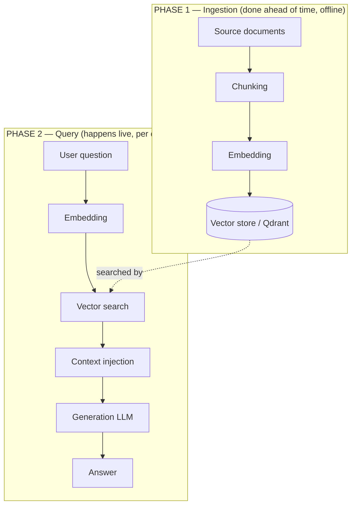

# RAG, Explained From Scratch

*A beginner's guide to how our Retrieval-Augmented Generation knowledge base works.*

This document is for someone who has never built a RAG system. It explains **what each part does**,
**why it exists**, and **how data flows** from a raw document all the way to an answer on screen. It
uses our own TrackFlow example throughout (delivery SLAs, returns, carriers, storage pricing).

If you want the engineering plan instead — file paths, phases, model choices — see
[`implementation-plan.md`](implementation-plan.md).

---

## 1. The problem RAG solves

A large language model (LLM) like DeepSeek is great at writing fluent answers, but it has two
weaknesses for a business:

1. **It doesn't know your private facts.** It was never trained on TrackFlow's returns policy, so if
   you ask "what's our standard return window?" it will *guess* — and a confident guess about a
   contract term is dangerous.
2. **It hallucinates.** When it doesn't know, it invents something plausible.

**Retrieval-Augmented Generation (RAG)** fixes both by changing *when* the model sees your facts.
Instead of hoping the facts are baked into the model, we **look them up at question time** and **paste
the relevant snippets into the prompt**. The model then answers *from the text we handed it*, not from
memory.

> **One sentence:** RAG = "search your documents for the relevant pieces, then ask the LLM to answer
> using only those pieces."

**RAG is not memory.** It does not remember your last conversation. Every question is answered fresh by
looking up documents. (Conversation memory is a different feature — that comes in Engagement 8.)

---

## 2. The big picture: two phases

RAG has two separate timelines. Keeping them straight is the key to understanding everything else.



- **Phase 1 — Ingestion** happens **once** (and again whenever documents change). We prepare the
  knowledge base ahead of time. Nobody is waiting on it.
- **Phase 2 — Query** happens **every time a user asks a question**, in real time, and must be fast.

The same embedding step appears in both phases — that's not a mistake, and section 5 explains why it
*must* be the same.

---

## 3. Phase 1, step by step: getting documents into the knowledge base

### 3.1 Source documents — where the truth lives

Everything starts with trusted, human-written source material. For us that's four Markdown files:

| Document | What it covers |
|---|---|
| `trackflow-sla-delivery.en.md` | Delivery times, on-time SLA, high-demand-date warning |
| `trackflow-returns-policy.en.md` | Return window, who pays, international-return handling |
| `trackflow-carrier-coverage.en.md` | Which carrier covers which zone (UPS, SEUR, MRW…) |
| `trackflow-storage-pricing.en.md` | Storage rates, grace period, long-term fees, discounts |

These are the **single source of truth**. The system will never say anything that isn't grounded in
these files. If the policy changes, we edit the file and re-ingest — we don't retrain a model.

### 3.2 Chunking — cutting documents into retrievable pieces

**What it is:** splitting each document into smaller passages ("chunks").

**Why we can't skip it:** we don't want to hand the LLM an *entire* document for every question — most
of it is irrelevant, it costs more, and it dilutes the answer. We want to retrieve *just the relevant
paragraph*. To do that, the document must already be broken into pieces we can search over
individually.

**Why chunk size matters — the make-or-break detail:** a chunk must be **self-contained**. If chunking
cuts a rule in half, retrieval returns a fragment that's missing its own condition, and the model will
either hallucinate the missing part or refuse to answer.

- ❌ **Bad chunk:** *"...pays a long-term inventory fee of 150% over the standard rate."* — 150% of
  *what*, starting *when*? The condition got cut off.
- ✅ **Good chunk:** *"Inventory with more than 180 days of no movement pays a 'long-term inventory'
  fee of 150% over the standard rate, starting on day 181."* — the whole rule survives together.

**Our strategy:** chunk by **semantic section** — a heading or a coherent paragraph group — not by a
blind character count. Each of our four documents naturally splits into a handful of self-contained
rules, so each produces at least three clean chunks (return window, return costs, international
returns, and so on).

### 3.3 Embeddings — turning text into searchable numbers

**What it is:** an **embedding model** reads a chunk of text and outputs a list of numbers — a
**vector** (for us, 1536 numbers). That vector is a coordinate in a high-dimensional "meaning space."

**The magic property:** texts that *mean* similar things get vectors that are *close together*, even if
they use different words. "What's the return window?" and "How long do customers have to send something
back?" land near each other, because the embedding model captures **meaning**, not just matching
keywords. This is why RAG beats a plain keyword search — a user rarely phrases a question using the
exact words in the policy.

**We use OpenAI `text-embedding-3-small`** for this. At ingestion time we call it once per chunk and
keep the resulting vectors.

### 3.4 Vector storage — the searchable index

**What it is:** a **vector database** (we use **Qdrant**) stores each chunk's vector alongside its
original text and some metadata ("payload"). It's purpose-built to answer one question extremely fast:
*"given this query vector, which stored vectors are closest?"*

Each stored record ("point") looks like this:

```jsonc
{
  "id": "a stable id",
  "vector": [/* the 1536 numbers from the embedding model */],
  "payload": {
    "company": "trackflow",
    "source_document": "returns-policy",   // which file it came from
    "section": "Return window",            // which part of the file
    "language": "en",
    "chunk_index": 2,
    "text": "Standard return window: 30 days from delivery..."  // the actual words
  }
}
```

Two things live in every record and both matter:
- The **vector** is what we *search by* (meaning).
- The **payload** — especially `text` — is what we later *hand to the LLM*, and `source_document` +
  `section` are how we can trace an answer back to its origin.

At the end of Phase 1, our knowledge base is "warm": all four documents are chunked, embedded, and
stored, ready to be searched in milliseconds.

---

## 4. Phase 2, step by step: answering a question

Now a real account manager types a question. Here's what happens on each request.

### 4.1 Embed the question

We take the user's question and run it through **the exact same embedding model** (`text-embedding-3-small`)
we used on the chunks. Now the question is a vector in the *same* meaning space as our stored chunks.

### 4.2 Retrieve — find the closest chunks

We ask Qdrant: *"here's the question vector — give me the `k` closest chunk vectors."* Closeness is
measured by **cosine similarity** (the angle between vectors); a higher score means "more similar in
meaning."

**The similarity threshold — a critical guardrail.** Asking for the "top `k`" (say, top 5) *always*
returns 5 results, even when the knowledge base contains nothing relevant. If someone asks "what's your
refund policy for cryptocurrency payments?" — which we don't document — top-k would still hand back the
5 *least irrelevant* chunks, and the model might stitch them into a confident, wrong answer.

So `retrieve()` applies a **minimum score (`min_score`)** and throws away any hit below it. It's
allowed to return fewer than `k` chunks — or **zero**. Returning nothing is a feature: **forcing bad
context into the prompt is worse than admitting we found nothing.**

`retrieve()` returns the surviving chunks' payloads (the `text` plus metadata) — never raw database
objects.

### 4.3 Context injection — building the prompt

This is the "Augmented" in RAG. We assemble a prompt for the generation model that contains:

1. **A system instruction** — *who* the model should be and the rules it must follow. For us:
   *"You are a TrackFlow salesperson. Answer only from the context below. Never invent rates,
   percentages, or timeframes. Never promise a delivery SLA on declared high-demand dates. International
   returns are always manual, never automatic. Storage discounts always require Miguel Torres's
   approval. If the context doesn't cover the question, say so honestly."*
2. **The retrieved chunks** — the actual policy text from step 4.2, pasted in as the "context."
3. **The user's question.**

The model now has the *exact relevant facts* sitting right in front of it. It doesn't need to remember
our policies — it can read them.

### 4.4 Generation — writing the answer

We send that assembled prompt to the **generation LLM** (**DeepSeek `deepseek-chat`**). It reads the
context and the question and writes a fluent, salesperson-voiced answer grounded in the provided text.

Example: for *"what's the standard return window?"* it retrieves the returns-policy chunk and answers
something like *"Our standard return window is 30 days from delivery, unless your contract specifies a
different window."* — the exact figure, phrased for a client, with no invention.

**The golden rule of this project:** the answer the user sees is **always** written by the generation
model *from* the retrieved context. We **never** return the raw search results directly. A vector
search returns fragments and similarity scores; a salesperson needs a sentence.

### 4.5 Back to the user

The endpoint (`POST /knowledge/query`) returns just the generated string: `{ "answer": "..." }`. The
similarity scores and raw chunks stay server-side (useful for debugging/logging, never shown to the
client). The Back Office "Ask your knowledge base" box displays the answer.

---

## 5. Two models, two jobs (a common beginner confusion)

RAG uses **two different AI models** that are easy to mix up:

| | Embedding model | Generation model |
|---|---|---|
| **Ours** | OpenAI `text-embedding-3-small` | DeepSeek `deepseek-chat` |
| **Job** | Turn text into a vector for *searching* | Turn context + question into a written *answer* |
| **Input → output** | text → list of numbers | text → text |
| **Used when** | Phase 1 (every chunk) **and** Phase 2 (the question) | Phase 2 only (once per question) |

They are **not interchangeable**. You must use a dedicated embeddings model for search and a separate
chat model for writing. They have different APIs, output shapes, costs, and failure modes.

**Why the embedding model must be identical in both phases:** you can only compare vectors that were
produced by the *same* model. Chunks embedded with model A and a question embedded with model B live in
different, incompatible "meaning spaces," so their distances are meaningless and search breaks. Same
embedding function at index time and query time — always.

---

## 6. How data flows, end to end (the one-paragraph recap)

A **source document** is split into self-contained **chunks**; each chunk is turned into a **vector**
by the embedding model and stored — text, metadata, and vector together — in the **vector store**
(Qdrant). Later, a **user question** is turned into a vector by the *same* embedding model; the vector
store is **searched** for the closest chunks; weak matches are dropped by a **similarity threshold**;
the surviving chunk text is **injected** into a prompt alongside instructions and the question; and the
**generation LLM** reads that prompt and writes the final **answer**, which is returned to the user.
Ingestion happens once and ahead of time; retrieval and generation happen live on every question.

---

## 7. Glossary

- **RAG** — Retrieval-Augmented Generation: retrieve relevant text, then let an LLM generate the answer
  from it.
- **Chunk** — a small, self-contained passage of a source document.
- **Embedding / vector** — a list of numbers representing the *meaning* of a piece of text.
- **Vector store** — a database (Qdrant) that finds the stored vectors nearest to a query vector.
- **Cosine similarity** — how we measure "closeness in meaning"; higher = more similar.
- **`min_score` / similarity threshold** — the cutoff below which a match is treated as "not relevant,"
  so we can return fewer results (or none).
- **Context injection** — pasting the retrieved chunks into the LLM's prompt.
- **Generation** — the LLM writing the final natural-language answer from the injected context.
- **Payload** — the metadata (and original text) stored next to each vector.
- **Faithfulness** — the guarantee that every figure in the answer comes from the retrieved text, never
  invented.
