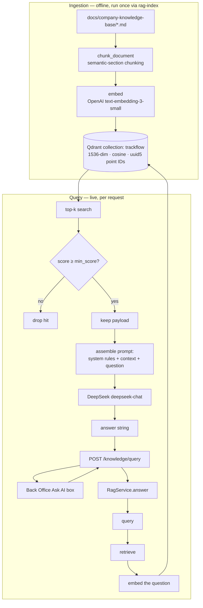

# RAG Knowledge Base — Design (Engagement 7)

This document explains the TrackFlow RAG stack end to end so another developer can understand it
without reading the code. For a from-scratch conceptual walkthrough, see
[`../planning/remaining_planning/07_rag_knowledge_base/rag-explainer.md`](../planning/remaining_planning/07_rag_knowledge_base/rag-explainer.md).

## 1. Responsibilities and where they live

The system is four separated, single-responsibility functions. Chunking is factored into the pure
`process` layer; the four graded functions live in the `pipelines` layer.

| Responsibility | Function | Location |
|---|---|---|
| Source corpus | — | `docs/company-knowledge-base/*.md` |
| Chunking (pure, no I/O) | `chunk_document` | `data/process/rag.py` |
| Index the corpus into Qdrant | `setup` | `data/pipelines/rag.py` |
| Embed one text (index + query time) | `embed` | `data/pipelines/rag.py` |
| Search + threshold filter | `retrieve` | `data/pipelines/rag.py` |
| Retrieve → prompt → generate | `query` | `data/pipelines/rag.py` |
| HTTP endpoint `POST /knowledge/query` | `RagService` / router | `services/central-api/central_api/domains/rag/` |
| Indexing CLI | `rag-index` | `services/central-api/scripts/rag_index.py` |
| Evaluation harness | `rag-eval` | `services/central-api/scripts/rag_eval.py` |
| Query UI | `AskKnowledgeBox` | `uis/backoffice/components/knowledge/` |

`query()` is the only function external consumers call. The FastAPI router imports it (via the
service) and never reimplements retrieval or generation. No orchestration framework (LangChain,
LlamaIndex) is used — the pipeline is written directly against the Qdrant and OpenAI SDKs.

## 2. RAG process (end to end)



At query time the question is embedded with the **same** `embed()` used at index time, searched
against Qdrant, filtered by `min_score`, injected into the prompt as context, and answered by the
generation model. The endpoint returns only the generated string — never raw chunks or scores.

## 3. Chunking strategy

**Strategy: chunk by semantic section, gluing lists to their intro.** Implemented in
`data/process/rag.py`:

1. Strip the `# H1` title; split the body on blank lines into paragraph blocks.
2. A bullet/numbered list is glued to the paragraph immediately above it, so a rule never separates
   from its conditions (e.g. "Standard shipping:" keeps its "3 to 5 business days" bullet).
3. A short intro paragraph that ends in a colon is glued to the block it introduces, so a lead-in is
   never stranded as its own fragment.

**Why it fits this corpus.** The four documents are short policy files whose meaning lives in
self-contained rules (a return window, a carrier's coverage, a storage fee). Fixed-size character
chunking would cut a percentage from its condition and cause hallucination or refusal. Section
chunking preserves each rule as one retrievable unit.

**Result (14 chunks total, every document ≥ 3):**

| `source_document` | Chunks |
|---|---|
| `sla-delivery` | 3 (service types & times · 90% SLA + compensation · high-demand warning) |
| `returns-policy` | 5 (process · return window · costs · international · scope) |
| `carrier-coverage` | 3 (US carriers · Spain carriers · carrier selection) |
| `storage-pricing` | 3 (rates & fees · aging report · volume discounts) |

`section` defaults to the document title and is refined to `"Title — Label"` when a chunk opens with
a short `Label:` lead, keeping retrieval hits traceable.

## 4. Embedding & generation practices

**Two models, two jobs, different model IDs (a hard requirement):**

| | Model | Purpose |
|---|---|---|
| Embeddings | OpenAI `text-embedding-3-small` | text → 1536-dim vector, for search |
| Generation | DeepSeek `deepseek-chat` (OpenAI-compatible API) | context + question → answer |

- **Vector dimension:** 1536. **Distance metric:** cosine. Both set when `setup()` creates the
  `trackflow` collection and must match the embedding model.
- **`embed()` is used consistently** at index time (each chunk) and query time (the question) — the
  same function, so vectors are comparable.
- **`min_score` threshold:** default `0.35` (cosine), tuned against `data/eval/rag/test-queries.json`.
  `retrieve()` filters hits below it in Python and may return fewer than `k` — or zero. On empty
  retrieval, `query()` still calls the model with an explicit "no context found" instruction so the
  answer is honest and model-generated, never invented.
- **`top_k`:** default 5. **Generation temperature:** 0.1 for faithfulness.
- **Preprocessing:** minimal — chunk text is embedded verbatim (policy wording is the signal). No
  lowercasing or stopword removal, which would distort the embeddings.

## 5. Storage & idempotency

- **Store:** self-hosted Qdrant (`compose.yaml` / `compose.coolify.yaml`), collection `trackflow`.
- **Point ID:** deterministic `uuid5(namespace, "{source_document}:{chunk_index}")`. Re-running
  `setup()` upserts in place — no duplicates. `rag-index --recreate` drops and rebuilds the
  collection for a clean reload.
- **Payload** (exact `context.md` field names + `text`): `company`, `source_document`, `section`,
  `language`, `chunk_index`, `text`.
- Postgres/Supabase and its migrations are untouched — vector data lives only in Qdrant.

## 6. Business constraints (enforced in the generation system prompt)

- Never promise a delivery SLA on declared high-demand dates (Black Friday, Christmas, January Sales);
  say times may extend and must be communicated in advance.
- International returns are always manual (Sofía Ramos's team), never "automatic".
- Never offer a storage discount without stating it requires Miguel Torres's approval.
- Answer only from retrieved context; never invent a percentage, rate, price, or timeframe.

## 7. KPIs & evaluation

- **Recall@3 ≥ 80%:** the expected `source_document` appears in the top-3 retrieval.
- **Faithfulness:** no rate/percentage/timeframe in an answer differs from the retrieved chunks.

Run `python -m scripts.rag_eval` (needs a live Qdrant + provider keys) to score both against
`data/eval/rag/test-queries.json` (10 questions across all four documents, including a Black Friday case).

## 8. Configuration

Central API settings (`core/config.py`, documented in `.env.example`): `RAG_ENABLED`, `QDRANT_URL`,
`QDRANT_API_KEY`, `RAG_COLLECTION`, `OPENAI_API_KEY`, `RAG_EMBEDDING_MODEL`, `RAG_EMBEDDING_DIM`,
`DEEPSEEK_API_KEY`, `DEEPSEEK_BASE_URL`, `RAG_GENERATION_MODEL`, `RAG_TOP_K`, `RAG_MIN_SCORE`. The
endpoint returns `503` unless `RAG_ENABLED=true` and both provider keys are set.

## 9. Running it locally

```bash
docker compose up -d qdrant postgres
# set RAG_ENABLED=true, OPENAI_API_KEY, DEEPSEEK_API_KEY in services/central-api/.env
cd services/central-api && uv run rag-index          # index the corpus (idempotent)
uv run rag-eval                                       # Recall@3 + faithfulness
uv run uvicorn central_api.main:app --port 8003      # serve POST /knowledge/query
```
